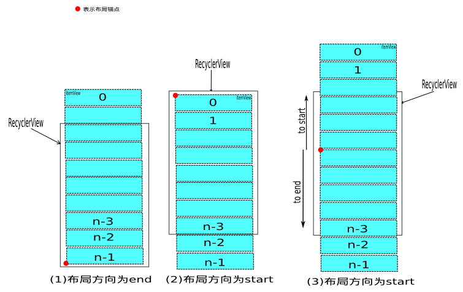
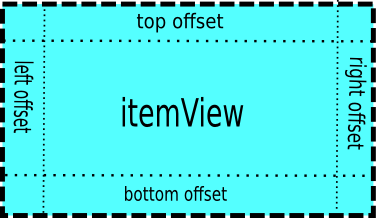
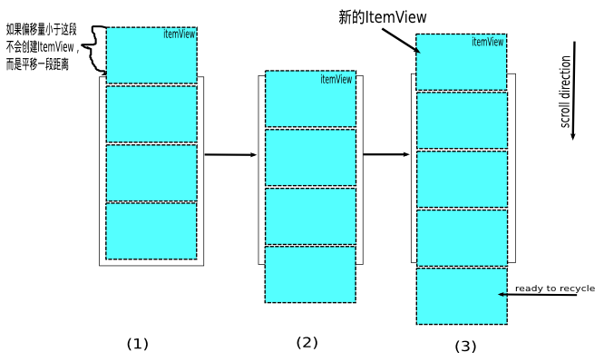
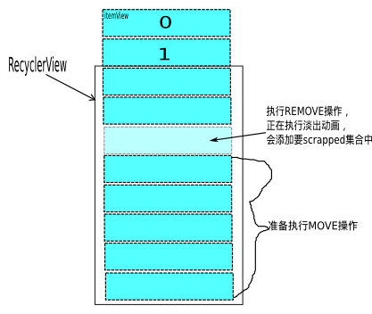
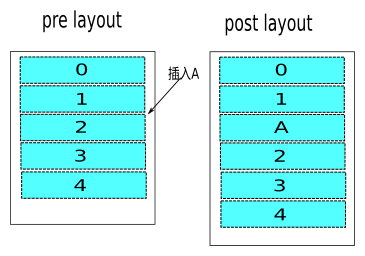

1、简介

​	本文将从RecyclerView实现原理并结合源码详细分析这个强大的控件

2、基本使用

​	RecyclerView的基本使用并不复杂，只需要提供一个RecyclerView.Apdater的实现用于处理数据集与ItemView的绑定关系，和一个RecyclerView.LayoutManager的实现用于测量并布局ItemView。

3、绘制流程

​	众所周知，android控件的绘制可以分为3个步骤：[measure、layout、draw](https://alex0605.github.io/2018/02/25/Android%E7%9F%A5%E8%AF%86-%E4%BA%8C-View%E7%9A%84%E7%BB%98%E5%88%B6%E6%B5%81%E7%A8%8B/)。RecyclerView的绘制自然也经这3个步骤。但是，RecyclerView将它的measure与layout过程委托给了RecyclerView.LayoutManager来处理，并且，它对子控件的measure及layout过程是逐个处理的，也就是说，执行完成一个子控件的measure及layout过程再去执行下一个。下面看下这段代码：

```java
protected void onMeasure(int widthSpec, int heightSpec) {
    ...
    if (mLayout.mAutoMeasure) {
        final int widthMode = MeasureSpec.getMode(widthSpec);
        final int heightMode = MeasureSpec.getMode(heightSpec);
        final boolean skipMeasure = widthMode == MeasureSpec.EXACTLY
                && heightMode == MeasureSpec.EXACTLY;
        mLayout.onMeasure(mRecycler, mState, widthSpec, heightSpec);
        if (skipMeasure || mAdapter == null) {
            return;
        }
        ...
        dispatchLayoutStep2();
        mLayout.setMeasuredDimensionFromChildren(widthSpec, heightSpec);
        ...
    } else {
        ...
    }
}
```

这是RecyclerView的测量方法，再看下dispatchLayoutStep2()方法：

```java
private void dispatchLayoutStep2() {
    ...
    mLayout.onLayoutChildren(mRecycler, mState);
    ...
}
```

​	上面的mLayout就是一个RecyclerView.LayoutManager实例。通过以上代码（和方法名称），不难推断出，RecyclerView的measure及layout过程委托给了RecyclerView.LayoutManager。接着看onLayoutChildren方法，在兼容包中提供了3个RecyclerView.LayoutManager的实现，这里我就只以LinearLayoutManager来举例说明：

```java
public void onLayoutChildren(RecyclerView.Recycler recycler, RecyclerView.State state) {
    // layout algorithm:
    // 1) by checking children and other variables, find an anchor coordinate and an anchor
    //  item position.
    // 2) fill towards start, stacking from bottom
    // 3) fill towards end, stacking from top
    // 4) scroll to fulfill requirements like stack from bottom.
    ...
    mAnchorInfo.mLayoutFromEnd = mShouldReverseLayout ^ mStackFromEnd;
    // calculate anchor position and coordinate
    updateAnchorInfoForLayout(recycler, state, mAnchorInfo);
    ...
    if (mAnchorInfo.mLayoutFromEnd) {
        ...
    } else {
        // fill towards end
        updateLayoutStateToFillEnd(mAnchorInfo);
        mLayoutState.mExtra = extraForEnd;
        fill(recycler, mLayoutState, state, false);
        endOffset = mLayoutState.mOffset;
        final int lastElement = mLayoutState.mCurrentPosition;
        if (mLayoutState.mAvailable > 0) {
            extraForStart += mLayoutState.mAvailable;
        }
        // fill towards start
        updateLayoutStateToFillStart(mAnchorInfo);
        mLayoutState.mExtra = extraForStart;
        mLayoutState.mCurrentPosition += mLayoutState.mItemDirection;
        fill(recycler, mLayoutState, state, false);
        startOffset = mLayoutState.mOffset;
        ...
    }
    ...
}
```

​	源码中的注释部分我并没有略去，它已经解释了此处的逻辑了。这里我以垂直布局来说明，mAnchorInfo为布局锚点信息，包含了子控件在Y轴上起始绘制偏移量（coordinate），ItemView在Adapter中的索引位置（position）和布局方向（mLayoutFromEnd）——这里是指start、end方向。这部分代码的功能就是：确定布局锚点，以此为起点向开始和结束方向填充ItemView，如图所示：



​	在上一段代码中，fill()方法的作用就是填充ItemView，而图（3）说明了，在上段代码中fill()方法调用2次的原因。虽然图（3）是更为普遍的情况，而且在实现填充ItemView算法时，也是按图（3）所示来实现的，但是mAnchorInfo在赋值过程(updateAnchorInfoForLayout)中，只会出现图（1）、图（2）所示情况。现在来看下fill()方法：

```java
int fill(RecyclerView.Recycler recycler, LayoutState layoutState,
        RecyclerView.State state, boolean stopOnFocusable) {
    ...
    int remainingSpace = layoutState.mAvailable + layoutState.mExtra;
    LayoutChunkResult layoutChunkResult = new LayoutChunkResult();
    while (...&&layoutState.hasMore(state)) {
        ...
        layoutChunk(recycler, state, layoutState, layoutChunkResult);
        ...
        if (...) {
            layoutState.mAvailable -= layoutChunkResult.mConsumed;
            remainingSpace -= layoutChunkResult.mConsumed;
        }
        if (layoutState.mScrollingOffset != LayoutState.SCOLLING_OFFSET_NaN) {
            layoutState.mScrollingOffset += layoutChunkResult.mConsumed;
            if (layoutState.mAvailable < 0) {
                layoutState.mScrollingOffset += layoutState.mAvailable;
            }
            recycleByLayoutState(recycler, layoutState);
        }
    }
    ...
}
```

下面是layoutChunk方法：

```java
void layoutChunk(RecyclerView.Recycler recycler, RecyclerView.State state,
        LayoutState layoutState, LayoutChunkResult result) {
    View view = layoutState.next(recycler);
    ...
    if (layoutState.mScrapList == null) {
        if (mShouldReverseLayout == (layoutState.mLayoutDirection
                == LayoutState.LAYOUT_START)) {
            addView(view);
        } else {
            addView(view, 0);
        }
    }
    ...
    measureChildWithMargins(view, 0, 0);
    ...
    // We calculate everything with View's bounding box (which includes decor and margins)
    // To calculate correct layout position, we subtract margins.
    layoutDecorated(view, left + params.leftMargin, top + params.topMargin,
            right - params.rightMargin, bottom - params.bottomMargin);
    ...
}
```

​	这里的addView()方法，其实就是ViewGroup的addView()方法；measureChildWithMargins()方法看名字就知道是用于测量子控件大小的，这里我先跳过这个方法的解释，放在后面来做，目前就简单地理解为测量子控件大小就好了。下面是layoutDecoreated()方法：

```java
public void layoutDecorated(...) {
    ...
    child.layout(...);
}
```

总结上面代码，在RecyclerView的measure及layout阶段，填充ItemView的算法为：向父容器增加子控件，测量子控件大小，布局子控件，布局锚点向当前布局方向平移子控件大小，重复上诉步骤至RecyclerView可绘制空间消耗完毕或子控件已全部填充。 
　　这样所有的子控件的measure及layout过程就完成了。回到RecyclerView的onMeasure方法，执行mLayout.setMeasuredDimensionFromChildren(widthSpec, heightSpec)这行代码的作用就是根据子控件的大小，设置RecyclerView的大小。至此，RecyclerView的measure和layout实际上已经完成了。 

​	但是，你有可能已经发现上面过程中的问题了：如何确定RecyclerView的可绘制空间？不过，如果你熟悉android控件的绘制机制的话，这就不是问题。其实，这里的可绘制空间，可以简单地理解为父容器的大小；更准确的描述是，父容器对RecyclerView的布局大小的要求，可以通过MeasureSpec.getSize()方法获得——这里不包括滑动情况，滑动情况会在后文描述。需要特别说明的是在23.2.0版本之前，RecyclerView是不支持WRAP_CONTENT的。先看下RecyclerView的onLayout()方法：

```java
protected void onLayout(boolean changed, int l, int t, int r, int b) {
    ...
    dispatchLayout();
    ...
}
```

这是dispatchLayout方法：

```java
void dispatchLayout() {
    ...
    if (mState.mLayoutStep == State.STEP_START) {
        dispatchLayoutStep1();
        ...
        dispatchLayoutStep2();
    }
    dispatchLayoutStep3();
    ...
}
```

​	可以看出，这里也会执行子控件的measure及layout过程。结合onMeasure方法对skipMeasure的判断可以看出，如果要支持WRAP_CONTENT，那么子控件的measure及layout就会提前在RecyclerView的测量方法中执行完成，也就是说，先确定了子控件的大小及位置后，再由此设置RecyclerView的大小；如果是其它情况(测量模式为EXACTLY)，子控件的measure及layout过程就会延迟至RecyclerView的layout过程（RecyclerView.onLayout()）中执行。

​	再看onMeasure方法中的mLayout.mAutoMeasure，它表示，RecyclerView的measure及layout过程是否要委托给RecyclerView.LayoutManager，在兼容包中提供的３种RecyclerView.LayoutManager的这个属性默认都是为true的。好了，以上就是RecyclerView的measure及layout过程，下面来看下它的draw过程。

​	RecyclerView的draw过程可以分为２部分来看：RecyclerView负责绘制所有decoration；ItemView的绘制由ViewGroup处理，这里的绘制是android常规绘制逻辑，本文就不再阐述了。下面来看看RecyclerView的draw()和onDraw()方法：

```java
@Override
public void draw(Canvas c) {
    super.draw(c);
    final int count = mItemDecorations.size();
    for (int i = 0; i < count; i++) {
        mItemDecorations.get(i).onDrawOver(c, this, mState);
    }
    ...
}
@Override
public void onDraw(Canvas c) {
    super.onDraw(c);
    final int count = mItemDecorations.size();
    for (int i = 0; i < count; i++) {
        mItemDecorations.get(i).onDraw(c, this, mState);
    }
}
```

​	可以看出对于decoration的绘制代码上十分简单。但是这里，我必须要抱怨一下RecyclerView.ItemDecoration的设计，它实在是太过于灵活了，虽然理论上我们可以使用它在RecyclerView内的任何地方绘制你想要的任何东西——到这一步，RecyclerView的大小位置已经确定的哦。但是过于灵活，太难使用，以至往往使我们无从下手。 好了，题外话就不多说了，来看看decoration的绘制吧。还记得上面提到过的measureChildWithMargins()方法吗？先来看看它：

```java
public void measureChildWithMargins(View child, int widthUsed, int heightUsed) {
        final LayoutParams lp = (LayoutParams) child.getLayoutParams();
    final Rect insets = mRecyclerView.getItemDecorInsetsForChild(child);
    widthUsed += insets.left + insets.right;
    heightUsed += insets.top + insets.bottom;

    final int widthSpec = ...
    final int heightSpec = ...
    if (shouldMeasureChild(child, widthSpec, heightSpec, lp)) {
        child.measure(widthSpec, heightSpec);
    }
}
```
这里是getItemDecorInsetsForChild()方法：

```java
Rect getItemDecorInsetsForChild(View child) {
    ...
    final Rect insets = lp.mDecorInsets;
    insets.set(0, 0, 0, 0);
    final int decorCount = mItemDecorations.size();
    for (int i = 0; i < decorCount; i++) {
        mTempRect.set(0, 0, 0, 0);
        mItemDecorations.get(i).getItemOffsets(mTempRect, child, this, mState);
        insets.left += mTempRect.left;
        insets.top += mTempRect.top;
        insets.right += mTempRect.right;
        insets.bottom += mTempRect.bottom;
    }
    lp.mInsetsDirty = false;
    return insets;
}
```

​	方法getItemOffsets()就是我们在实现一个RecyclerView.ItemDecoration时可以重写的方法，通过mTempRect的大小，可以为每个ItemView设置位置偏移量，这个偏移量最终会参与计算ItemView的大小，也就是说ItemView的大小是包含这个位置偏移量的。我们在重写getItemOffsets()时，可以指定任意数值的偏移量：



4个方向的位置偏移量对应mTempRect的4个属性(left,top,right,bottom)，我以top offset的值在垂直线性布局中的应用来举例说明下。如果top offset等于0，那么ItemView之间就没有空隙；如果top offset大于0，那么ItemView之前就会有一个间隙；如果top offset小于0，那么ItemView之间就会有重叠的区域。 

​	当然，我们在实现RecyclerView.ItemDecoration时，并不一定要重写getItemOffsets()，同样的对于RecyclerView.ItemDecoration.onDraw()或RecyclerView.ItemDecoration.onDrawOver()方法也不是一定要重写，而且，这个绘制方法和我们所设置的位置偏移量没有任何联系。下面我来实现一个RecyclerView.ItemDecoration来加深下这里的理解：我将在垂直线性布局下，在ItemView间绘制一条5个像素宽、只有ItemView一半长、与ItemView居中对齐的红色分割线，这条分割线在ItemView内部top位置。

```java
@Override
public void onDraw(Canvas c, RecyclerView parent, RecyclerView.State state) {
  Paint paint = new Paint();
  paint.setColor(Color.RED);
  for (int i = 0; i < parent.getLayoutManager().getChildCount(); i++) {
    final View child = parent.getChildAt(i);
    float left = child.getLeft() + (child.getRight() - child.getLeft()) / 4;
    float top = child.getTop();
    float right = left + (child.getRight() - child.getLeft()) / 2;
    float bottom = top + 5;
    c.drawRect(left,top,right,bottom,paint);
  }
}
@Override
public void getItemOffsets(Rect outRect, View view, RecyclerView parent, RecyclerView.State state) {
  outRect.set(0, 0, 0, 0);
}
```

代码不是很严谨，大家姑且一看吧，当然这里getItemOffsets()方法可以省略的。 

​	以上就是RecyclerView的整个绘制流程了，值得注意的地方也就是在23.2.0中RecyclerView支持WRAP_CONTENT属性了；还有就是ItemView的填充算法fill()算是一个亮点吧。接下来，我将分析ReyclerView的滑动流程。

4、滑动流程

​	RecyclerView的滑动过程可以分为2个阶段：手指在屏幕上移动，使RecyclerView滑动的过程，可以称为scroll；手指离开屏幕，RecyclerView继续滑动一段距离的过程，可以称为fling。现在先看看RecyclerView的触屏事件处理onTouchEvent()方法：

```java
public boolean onTouchEvent(MotionEvent e) {
	...
    if (mVelocityTracker == null) {
        mVelocityTracker = VelocityTracker.obtain();
    }
	...
    switch (action) {
    ...
        case MotionEvent.ACTION_MOVE: {
        ...
            final int x = (int) (MotionEventCompat.getX(e, index) + 0.5f);
            final int y = (int) (MotionEventCompat.getY(e, index) + 0.5f);
            int dx = mLastTouchX - x;
            int dy = mLastTouchY - y;
        ...
            if (mScrollState != SCROLL_STATE_DRAGGING) {
            ...
                if (canScrollVertically && Math.abs(dy) > mTouchSlop) {
                    if (dy > 0) {
                        dy -= mTouchSlop;
                    } else {
                        dy += mTouchSlop;
                    }
                    startScroll = true;
                }
                if (startScroll) {
                    setScrollState(SCROLL_STATE_DRAGGING);
                }
            }
            if (mScrollState == SCROLL_STATE_DRAGGING) {
                mLastTouchX = x - mScrollOffset[0];
                mLastTouchY = y - mScrollOffset[1];
                if (scrollByInternal(
                        canScrollHorizontally ? dx : 0,
                        canScrollVertically ? dy : 0,
                        vtev)) {
                    getParent().requestDisallowInterceptTouchEvent(true);
                }
            }
        } break;
    	...
        case MotionEvent.ACTION_UP: {
        ...
            final float yvel = canScrollVertically ?
                    -VelocityTrackerCompat.getYVelocity(mVelocityTracker, mScrollPointerId) : 0;
            if (!((xvel != 0 || yvel != 0) && fling((int) xvel, (int) yvel))) {
                setScrollState(SCROLL_STATE_IDLE);
            }
            resetTouch();
        } break;
    	...
    }
	...
}
```

​	这里我以垂直方向的滑动来说明。当RecyclerView接收到ACTION_MOVE事件后，会先计算出手指移动距离（dy），并与滑动阀值（mTouchSlop）比较，当大于此阀值时将滑动状态设置为SCROLL_STATE_DRAGGING，而后调用scrollByInternal()方法，使RecyclerView滑动，这样RecyclerView的滑动的第一阶段scroll就完成了；当接收到ACTION_UP事件时，会根据之前的滑动距离与时间计算出一个初速度yvel，这步计算是由VelocityTracker实现的，然后再以此初速度，调用方法fling()，完成RecyclerView滑动的第二阶段fling。显然滑动过程中关键的方法就2个：scrollByInternal()与fling()。接下来同样以垂直线性布局来说明。先来说明scrollByInternal()，跟踪进入后，会发现它最终会调用到LinearLayoutManager.scrollBy()方法，这个过程很简单，我就不列出源码了，但是分析到这里先暂停下，去看看fling()方法：

```java
public boolean fling(int velocityX, int velocityY) {
	...
    mViewFlinger.fling(velocityX, velocityY);
	...
}
```

​	有用的就这一行，其它乱七八糟的不看也罢。mViewFlinger是一个Runnable的实现ViewFlinger的对象，就是它来控件着ReyclerView的fling过程的算法的。下面来看下类ViewFlinger的一段代码：

```java
void postOnAnimation() {
    if (mEatRunOnAnimationRequest) {
        mReSchedulePostAnimationCallback = true;
    } else {
        removeCallbacks(this);
        ViewCompat.postOnAnimation(RecyclerView.this, this);
    }
}
public void fling(int velocityX, int velocityY) {
    setScrollState(SCROLL_STATE_SETTLING);
    mLastFlingX = mLastFlingY = 0;
    mScroller.fling(0, 0, velocityX, velocityY,
            Integer.MIN_VALUE, Integer.MAX_VALUE, Integer.MIN_VALUE, Integer.MAX_VALUE);
    postOnAnimation();
}
```

​	可以看到，其实RecyclerView的fling是借助Scroller实现的；然后postOnAnimation()方法的作用就是在将来的某个时刻会执行我们给定的一个Runnable对象，在这里就是这个mViewFlinger对象，这部分原理我就不再深入分析了，它已经不属于本文的范围了。并且，关于Scroller的作用及原理，本文也不会作过多解释。对于这两点各位可以自行查阅，有很多文章对于作过详细阐述的。接下来看看ViewFlinger.run()方法：

```java
public void run() {
    ...
    if (scroller.computeScrollOffset()) {
        final int x = scroller.getCurrX();
        final int y = scroller.getCurrY();
        final int dx = x - mLastFlingX;
        final int dy = y - mLastFlingY;
        ...
        if (mAdapter != null) {
        ...
            if (dy != 0) {
                vresult = mLayout.scrollVerticallyBy(dy, mRecycler, mState);
                overscrollY = dy - vresult;
            }
        ...
        }
        ...
        if (!awakenScrollBars()) {
            invalidate();//刷新界面
        }
        ...
        if (scroller.isFinished() || !fullyConsumedAny) {
            setScrollState(SCROLL_STATE_IDLE);
        } else {
            postOnAnimation();
        }
    }
    ...
}
```

​	本段代码中有个方法mLayout.scrollVerticallyBy()，跟踪进入你会发现它最终也会走到LinearLayoutManager.scrollBy()，这样虽说RecyclerView的滑动可以分为两阶段，但是它们的实现最终其实是一样的。这里我先解释下上段代码。第一，dy表示滑动偏移量，它是由Scroller根据时间偏移量（Scroller.fling()开始时间到当前时刻）计算出的，当然如果是RecyclerView的scroll阶段，这个偏移量也就是手指滑动距离。第二，上段代码会多次执行，至到Scroller判断滑动结束或已经滑动到边界。再多说一下，postOnAnimation()保证了RecyclerView的滑动是流畅，这里涉及到著名的“android 16ms”机制，简单来说理想状态下，上段代码会以16毫秒一次的速度执行，这样其实，Scroller每次计算的滑动偏移量是很小的一部分，而RecyclerView就会根据这个偏移量，确定是平移ItemView，还是除了平移还需要再创建新ItemView。



现在就来看看LinearLayoutManager.scrollBy()方法：

```java
int scrollBy(int dy, RecyclerView.Recycler recycler, RecyclerView.State state) {
    ...
    final int absDy = Math.abs(dy);
    updateLayoutState(layoutDirection, absDy, true, state);
    final int consumed = mLayoutState.mScrollingOffset
            + fill(recycler, mLayoutState, state, false);
    ...
    final int scrolled = absDy > consumed ? layoutDirection * consumed : dy;
    mOrientationHelper.offsetChildren(-scrolled);
    ...
}
```

​	如上文所讲到的fill()方法，作用就是向可绘制区间填充ItemView，那么在这里，可绘制区间就是滑动偏移量！再看方法mOrientationHelper.offsetChildren()作用就是平移ItemView。好了整个滑动过程就分析完成了，当然RecyclerView的滑动还有个特性叫平滑滑动（smooth scroll），其实它的实现就是一个fling滑动，所以就不再赘述了。

5、Recycler

　Recycler的作用就是重用ItemView。在填充ItemView的时候，ItemView是从它获取的；滑出屏幕的ItemView是由它回收的。对于不同状态的ItemView存储在了不同的集合中，比如有scrapped、cached、exCached、recycled，当然这些集合并不是都定义在同一个类里。 

​	回到之前的layoutChunk方法中，有行代码layoutState.next(recycler)，它的作用自然就是获取ItemView，我们进入这个方法查看，最终它会调用到RecyclerView.Recycler.getViewForPosition()方法：

```java
View getViewForPosition(int position, boolean dryRun) {
	...
    // 0) If there is a changed scrap, try to find from there
    if (mState.isPreLayout()) {
        holder = getChangedScrapViewForPosition(position);
        fromScrap = holder != null;
    }
    // 1) Find from scrap by position
    if (holder == null) {
        holder = getScrapViewForPosition(position, INVALID_TYPE, dryRun);
    ...
    }
    if (holder == null) {
    ...
        // 2) Find from scrap via stable ids, if exists
        if (mAdapter.hasStableIds()) {
            holder = getScrapViewForId(mAdapter.getItemId(offsetPosition), type, dryRun);
        ...
        }
        if (holder == null && mViewCacheExtension != null) {
            final View view = mViewCacheExtension
                    .getViewForPositionAndType(this, position, type);
            if (view != null) {
                holder = getChildViewHolder(view);
            ...
            }
        }
        if (holder == null) {
        ...
            holder = getRecycledViewPool().getRecycledView(type);
        ...
        }
        if (holder == null) {
            holder = mAdapter.createViewHolder(RecyclerView.this, type);
        ...
        }
    }
	...
    boolean bound = false;
    if (mState.isPreLayout() && holder.isBound()) {
        // do not update unless we absolutely have to.
        holder.mPreLayoutPosition = position;
    } else if (!holder.isBound() || holder.needsUpdate() || holder.isInvalid()) {
    ...
        mAdapter.bindViewHolder(holder, offsetPosition);
    ...
    }
	...
}
```

​	这个方法比较长，我先解释下它的逻辑吧。根据列表位置获取ItemView，先后从scrapped、cached、exCached、recycled集合中查找相应的ItemView，如果没有找到，就创建（Adapter.createViewHolder()），最后与数据集绑定。其中scrapped、cached和exCached集合定义在RecyclerView.Recycler中，分别表示将要在RecyclerView中删除的ItemView、一级缓存ItemView和二级缓存ItemView，cached集合的大小默认为２，exCached是需要我们通过RecyclerView.ViewCacheExtension自己实现的，默认没有；recycled集合其实是一个Map，定义在RecyclerView.RecycledViewPool中，将ItemView以ItemType分类保存了下来，这里算是RecyclerView设计上的亮点，通过RecyclerView.RecycledViewPool可以实现在不同的RecyclerView之间共享ItemView，只要为这些不同RecyclerView设置同一个RecyclerView.RecycledViewPool就可以了。 

​	上面解释了ItemView从不同集合中获取的方式，那么RecyclerView又是在什么时候向这些集合中添加ItemView的呢？下面我逐个介绍下。 scrapped集合中存储的其实是正在执行REMOVE操作的ItemView，这部分会在后文进一步描述。 在fill()方法的循环体中有行代码recycleByLayoutState(recycler, layoutState);，最终这个方法会执行到RecyclerView.Recycler.recycleViewHolderInternal()方法：

```java
void recycleViewHolderInternal(ViewHolder holder) {
    ...
    if (forceRecycle || holder.isRecyclable()) {
        if (!holder.hasAnyOfTheFlags(ViewHolder.FLAG_INVALID | ViewHolder.FLAG_REMOVED
                | ViewHolder.FLAG_UPDATE)) {
            // Retire oldest cached view
            final int cachedViewSize = mCachedViews.size();
            if (cachedViewSize == mViewCacheMax && cachedViewSize > 0) {
                recycleCachedViewAt(0);
            }
            if (cachedViewSize < mViewCacheMax) {
                mCachedViews.add(holder);
                cached = true;
            }
        }
        if (!cached) {
            addViewHolderToRecycledViewPool(holder);
            recycled = true;
        }
    }
    ...
}
```

​	这个方法的逻辑是这样的：首先判断集合cached是否満了，如果已満就从cached集合中移出一个到recycled集合中去，再把新的ItemView添加到cached集合；如果不満就将ItemView直接添加到cached集合。 

​	最后exCached集合是我们自己创建的，所以添加删除元素也要我们自己实现。

6、数据集、动画

　　RecyclerView定义了4种针对数据集的操作，分别是ADD、REMOVE、UPDATE、MOVE，封装在了AdapterHelper.UpdateOp类中，并且所有操作由一个大小为30的对象池管理着。当我们要对数据集作任何操作时，都会从这个对象池中取出一个UpdateOp对象，放入一个等待队列中，最后调用RecyclerView.RecyclerViewDataObserver.triggerUpdateProcessor()方法，根据这个等待队列中的信息，对所有子控件重新测量、布局并绘制且执行动画。以上就是我们调用Adapter.notifyItemXXX()系列方法后发生的事。 

​	显然当我们对某个ItemView做操作时，它很有可以会影响到其它ItemView。下面我以REMOVE为例来梳理下这个流程。 



首先调用Adapter.notifyItemRemove()，追溯到方法RecyclerView.RecyclerViewDataObserver.onItemRangeRemoved()：

```java
public void onItemRangeRemoved(int positionStart, int itemCount) {
    assertNotInLayoutOrScroll(null);
    if (mAdapterHelper.onItemRangeRemoved(positionStart, itemCount)) {
        triggerUpdateProcessor();
    }
}
```

​	这里的mAdapterHelper.onItemRangeRemoved()就是向之前提及的等待队列添加一个类型为REMOVE的UpdateOp对象， triggerUpdateProcessor()方法就是调用View.requestLayout()方法，这会导致界面重新布局，也就是说方法RecyclerView.onLayout()会随后调用，这之后的流程就和在绘制流程一节中所描述的一致了。但是动画在哪是执行的呢？查看之前所列出的onLayout()方法发现dispatchLayoutStepX方法共有3个，前文只解释了dispatchLayoutStep2()的作用，这里就其它2个方法作进一步说明。不过dispatchLayoutStep1()没有过多要说明的东西，它的作用只是初始化数据，需要详细说明的是dispatchLayoutStep3()方法：

```java
private void dispatchLayoutStep3() {
    ...
    if (mState.mRunSimpleAnimations) {
        // Step 3: Find out where things are now, and process change animations.
        ...
        // Step 4: Process view info lists and trigger animations
        mViewInfoStore.process(mViewInfoProcessCallback);
    }
    ...
}
```

​	代码注释已经说明得很清楚了，这里我没有列出step 3相关的代码是因为这部分只是初始化或赋值一些执行动画需要的中间数据，process()方法最终会执行到RecyclerView.animateDisappearance()方法：

```java
private void animateDisappearance(...) {
    addAnimatingView(holder);
    holder.setIsRecyclable(false);
    if (mItemAnimator.animateDisappearance(holder, preLayoutInfo, postLayoutInfo)) {
        postAnimationRunner();
    }
}
```

​	这里的animateDisappearance()会把一个动画与ItemView绑定，并添加到待执行队列中， postAnimationRunner()调用后就会执行这个队列中的动画，注意方法addAnimatingView()：

```java
private void addAnimatingView(ViewHolder viewHolder) {
    final View view = viewHolder.itemView;
    ...
    mChildHelper.addView(view, true);
    ...
}
```

​	这里最终会向ChildHelper中的一个名为mHiddenViews的集合添加给定的ItemView，那么这个mHiddenViews又是什么东西？上节中的getViewForPosition()方法中有个getScrapViewForPosition()，作用是从scrapped集合中获取ItemView：

```java
ViewHolder getScrapViewForPosition(int position, int type, boolean dryRun) {
    ...
    View view = mChildHelper.findHiddenNonRemovedView(position, type);
    ...
}
```

接下来是findHiddenNonRemovedView()方法：

```java
View findHiddenNonRemovedView(int position, int type) {
    final int count = mHiddenViews.size();
    for (int i = 0; i < count; i++) {
        final View view = mHiddenViews.get(i);
        RecyclerView.ViewHolder holder = mCallback.getChildViewHolder(view);
        if (holder.getLayoutPosition() == position && !holder.isInvalid() && !holder.isRemoved()
                && (type == RecyclerView.INVALID_TYPE || holder.getItemViewType() == type)) {
            return view;
        }
    }
    return null;
}
```

看到这里就之前所讲的scrapped集合联系起来了，虽然绕了个圈。所以这里就论证我之前对于scrapped集合的理解。 

7、pre&post layout

​	在RecyclerView中存在一个叫“预布局”的阶段，当然这个是我自己作的翻译，本来叫pre layout，与之对应的还有个叫post layout的阶段，它们分别发生在真正的子控件测量&布局的前后。其中pre layout阶段的作用是记录数据集改变前的子控件信息，post layout阶段的作用是记录数据集改变后的子控件信息及触发动画。

```java
void dispatchLayout() {
    ...
    if (mState.mLayoutStep == State.STEP_START) {
        dispatchLayoutStep1();
       ...
        dispatchLayoutStep2();
    }
    dispatchLayoutStep3();
    ...
}
```

方法dispatchLayout()会在RecyclerView.onLayout()中被调用，其中dispatchLayoutStep1就是pre layout，dispatchLayoutStep3就是post layout，而dispatchLayoutStep2自然就是处理真正测量&布局的了。 
　　首先来看看pre layout时都记录了什么内容：

```java
private void dispatchLayoutStep1() {
    ...
    if (mState.mRunSimpleAnimations) {
        // Step 0: Find out where all non-removed items are, pre-layout
        int count = mChildHelper.getChildCount();
        for (int i = 0; i < count; ++i) {
            final ViewHolder holder = ...
            ...
            final ItemHolderInfo animationInfo = mItemAnimator
                    .recordPreLayoutInformation(...);
            mViewInfoStore.addToPreLayout(holder, animationInfo);
            ...
        }
    }
    ...
}
```

类ItemHolderInfo中封闭了对应ItemView的边界信息，即ItemView的left、top、right、bottom值。对象mViewInfoStore的作用正如源码注释：

```java
  /**
   * Keeps data about views to be used for animations
   */
  final ViewInfoStore mViewInfoStore = new ViewInfoStore();
```

再来看看addToPreLayout()方法：

```java
void addToPreLayout(ViewHolder holder, ItemHolderInfo info) {
    InfoRecord record = mLayoutHolderMap.get(holder);
    if (record == null) {
        record = InfoRecord.obtain();
        mLayoutHolderMap.put(holder, record);
    }
    record.preInfo = info;
    record.flags |= FLAG_PRE;
}
```

由上可已看出RecyclerView将pre layout阶段的ItemView信息存放在了ViewInfoStore中的mLayoutHolderMap集合中。 
　　接下来我们看看post layout阶段：

```java
private void dispatchLayoutStep3() {
    ...
    if (mState.mRunSimpleAnimations) {
        // Step 3: Find out where things are now, and process change animations.
        ...
        for (int i = mChildHelper.getChildCount() - 1; i >= 0; i--) {
            ...
            final ItemHolderInfo animationInfo = mItemAnimator
                    .recordPostLayoutInformation(mState, holder);
            ...
            if (...) {
                ...
                animateChange(oldChangeViewHolder, holder, preInfo, postInfo,
                                oldDisappearing, newDisappearing);
            } else {
                mViewInfoStore.addToPostLayout(holder, animationInfo);
            }
        }
        // Step 4: Process view info lists and trigger animations
        mViewInfoStore.process(mViewInfoProcessCallback);
    }
    ...
}
```

这是addToPostLayout()方法：

```java
void addToPostLayout(ViewHolder holder, ItemHolderInfo info) {
    InfoRecord record = mLayoutHolderMap.get(holder);
    if (record == null) {
        record = InfoRecord.obtain();
        mLayoutHolderMap.put(holder, record);
    }
    record.postInfo = info;
    record.flags |= FLAG_POST;
}
```

与pre layout阶段相同RecyclerView也是将post layout阶段的ItemView信息存放在mViewInfoStore的mLayoutHolderMap集合中，并且不难看出，同一个ItemView（或者叫ViewHolder）的pre layout信息与post layout信息封装在了同一个InfoRecord中，分别叫InfoRecord.preInfo与InforRecord.postInfo，**这样InfoRecord就保存着同一个ItemView在数据集变化前后的信息，我们可以根据此信息定义动画的开始和结束状态。** 



​	如上图所示，当我们插入A时，在完成了上文所诉过程后，以ItemView2为例，通过比较它的preInfo与postInfo——都为非空，源码中是以标志位的形式实现的，就可以知道它将执行MOVE操作；而A自然就是ADD操作。下面是ViewInfoStore.ProcessCallback实现中的其中一个方法，它会在mViewInfoStore.process()方法中被调用：

```java
public void processPersistent(...) {
        ...
        if (mDataSetHasChangedAfterLayout) {
            ...
        } else if (mItemAnimator.animatePersistence(viewHolder, preInfo, postInfo)) {
            postAnimationRunner();
        }
    }
```

我们知道，RecyclerView中ItemAnimator的默认实现是DefaultItemAnimator，这里我就只以默认实现来说明，这是animatePersistence()方法：

```java
public boolean animatePersistence(...) {
    if (preInfo.left != postInfo.left || preInfo.top != postInfo.top) {
        ...
        return animateMove(viewHolder,
                preInfo.left, preInfo.top, postInfo.left, postInfo.top);
    }
    dispatchMoveFinished(viewHolder);
    return false;
}
```

当然这个方法在DefaultItemAnimator的父类SimpleItemAnimator中，通过比较preInfo与postInfo的left和top属性分别确定ItemView在水平或垂直方向是否要执行MOVE操作，而上面的方法postAnimationRunner()就是用来触发动画执行的。 
　　通过前文我们知道，RecyclerView中定义了4种针对数据集的操作（也可以称为针对ItemView的操作），分别是ADD、REMOVE、UPDATE、MOVE，RecyclerView就是通过比较preInfo与postInfo来确定ItemView要执行哪种操作的，上文我描述了MOVE情况，这个比较过程是在方法ViewInfoStore.process()中实现的，其它情况我就不再赘述了，各位不妨自己去看看。 
　　在DefaultItemAnimator中实现了上面4种操作下的动画。当postAnimationRunner()执行后，会触发DefaultItemAnimator.runPendingAnimations()方法的调用，这个方法过长，我这里只作下解释便可。4种操作对应的动画是有先后顺序的，remove–>move&change–>add，之所以有这样的顺序，不难看出是为了不让ItemView之间有重叠的区域，这个顺序是由ViewCompat.postOnAnimationDelayed()方法通过控制延时来实现的。在DefaultItemAnimator中，REMOVE和ADD对应的是淡入淡出动画（改变透明度），MOVE对应的是平移动画；UPDATE相对来说要复杂一些，是因为它不再是记录同一个ItemView的变化情况，而是记录2个ItemView的信息来作比较，pre layout阶段的信息来自“oldChangeViewHolder”，post layout阶段的信息来自“holder”，这两个对象在dispatchLayoutStep3方法中可以找到，而且，这2个ItemView的动画是同时执行的，所以它对应的动画是：“oldHolder”淡出且向“newHolder”平移，同时“newHolder”淡入。特别说明，前文有提过一个叫scrapped的集合，其实它除了保存REMOVE操作的ItemView，还保存着UPDATE操作中的“oldHolder”！ 
　　以上就是RecyclerView默认动画的具体实现逻辑了，总结下来就是：当数据集发生变化时，会导致RecyclerView重新测量&布局子控件，我们记录下这个变化前后的RecyclerView的快照（preInfo与postInfo），通过比较这2个快照，从而确定子控件要执行什么操作，最后再实现不同操作下对应的动画就好了。通常我们会调用notifyItemXXX()系列方法来通知RecyclerView数据集变化，这些方法之所以比notifyDataSetChanged()高效的原因就是它们不会让整个RecyclerView重新绘制，而是只重绘具体的子控件，并且通过动画连接子控件的前后状态，这样也就实现了在Material design中所讲的“Visual continuity”效果。

8、子控件的测量与布局

这一节将对preInfo与postInfo是如果确定（赋值）的，作进一步描述。 
　　从前文我们知道，子控件的测量与布局其实在RecyclerView的测量阶段（onMeasure）就执行完了，这样做是为了支持WRAP_CONTENT，具体的方法呢就是dispatchLayoutStep1()与dispatchLayoutStep2()，同样这两个方法也会出现在RecyclerView的布局阶段（onLayout），但并不是说它们就会被调用，这里的调用逻辑是由RecyclerView.State类控制的，它定义了RecyclerView的整个测量布局过程，分为3步STEP_START、STEP_LAYOUT、STEP_ANIMATIONS，具体流程是：初始状态是STEP_START；如果RecyclerView当前在STEP_START阶段dispatchLayoutStep1()会执行，记录下preInfo，将状态改为STEP_LAYOUT；如果RecyclerView在STEP_LAYOUT阶段dispatchLayoutStep2()会执行，测量布局子控件，将状态改为STEP_ANIMATIONS；如果RecyclerView在STEP_ANIMATIONS阶段dispatchLayoutStep3()会执行，记录下postInfo，触发动画，将状态改为STEP_START。每次数据集更改都会执行上述3步。 
　　在测量布局子控件的过程中，最重要的莫过于确定布局锚点了，以LinearLayoutManager垂直布局为例，在onLayoutChildren()方法中，会调用updateAnchorInfoForLayout()方法来确定布局锚点：

```java
private void updateAnchorInfoForLayout(...) {
    if (updateAnchorFromPendingData(state, anchorInfo)) {
        ...
        return;
    }
    if (updateAnchorFromChildren(recycler, state, anchorInfo)) {
        ...
        return;
    }
    ...
    anchorInfo.assignCoordinateFromPadding();
    anchorInfo.mPosition = mStackFromEnd ? state.getItemCount() - 1 : 0;
}
```

​	这里布局锚点的确定方法有3种依据。首先，如果是第一次布局（没有ItemView），这种情况已经在前文有过描述了，这里就不再说明；剩余的2种分别是“滑动位置”与“子控件”，这2种情况都是发生在已经有ItemView时的，而且这里的“滑动位置”是指由方法scrollToPosition()确认的，并赋给了mPendingScrollPosition变量。现在先来看看“滑动位置”updateAnchorFromPendingData()方法：

```java
private boolean updateAnchorFromPendingData(...) {
    ...
    // if child is visible, try to make it a reference child and ensure it is fully visible.
    // if child is not visible, align it depending on its virtual position.
    anchorInfo.mPosition = mPendingScrollPosition;
    ...
    if (mPendingScrollPositionOffset == INVALID_OFFSET) {
        View child = findViewByPosition(mPendingScrollPosition);
        if (child != null) {
            ...
        } else { // item is not visible.
            ...
        }
        return true;
    }
    ...
    return true;
}
```

布局锚点中的mCoordinate与mPosition，在前文描述为起始绘制偏移量与索引位置，再直白点就是屏幕位置与数据集位置，就是告诉RecyclerView从屏幕的mCoordinate位置开始填充子控件，与子控件绑定的数据从数据集的mPosition位置开始取得。上面这个方法中确定“屏幕位置”分为2种情况，就是对应于mPendingScrollPosition是否存在子控件，mCoordinate值的确定我就不再讲述了，无非是一边界判断的语句。 
　　下面来看看“子控件”依据的情况，这是updateAnchorFromChildren()：

```java
private boolean updateAnchorFromChildren(...) {
    ...
    View referenceChild = anchorInfo.mLayoutFromEnd
            ? findReferenceChildClosestToEnd(recycler, state)
            : findReferenceChildClosestToStart(recycler, state);
    if (referenceChild != null) {
        anchorInfo.assignFromView(referenceChild);
        ...
        return true;
    }
    return false;
}
```

​	这种情况也并不复杂，就是找到最外边的一个子控件，以它的位置信息来确定布局锚点，就是方法assignFromView()，我也就不再列出来了。以上就是详细的布局锚点确认过程了。 