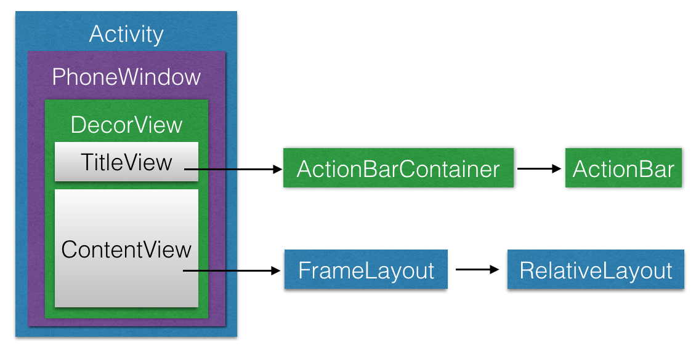
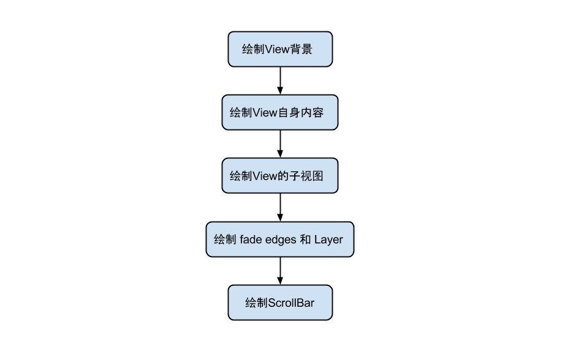

### 1、View 绘制依赖关系简介

#### 1.1、概述



​	如上图所示：DecorView是一个应用窗口的根容器，它本质上是一个FrameLayout。DecorView有唯一一个子View，它是一个垂直LinearLayout，包含两个子元素，一个是TitleView（ActionBar的容器），另一个是ContentView（窗口内容的容器）。关于ContentView，它是一个FrameLayout（android.R.id.content)，我们平常用的setContentView就是设置它的子View。上图还表达了每个Activity都与一个Window（具体来说是PhoneWindow）相关联，用户界面则由Window所承载。

#### 1.2、window

​	Window即窗口，这个概念在Android Framework中的实现为android.view.Window这个抽象类，这个抽象类是对Android系统中的窗口的抽象。在介绍这个类之前，我们先来看看究竟什么是窗口呢？

实际上，窗口是一个宏观的思想，它是屏幕上用于绘制各种UI元素及响应用户输入事件的一个矩形区域。通常具备以下两个特点：

- 独立绘制，不与其它界面相互影响；
- 不会触发其它界面的输入事件；

​	在Android系统中，窗口是独占一个Surface实例的显示区域，每个窗口的Surface由WindowManagerService分配。我们可以把Surface看作一块画布，应用可以通过Canvas或OpenGL在其上面作画。画好之后，通过SurfaceFlinger将多块Surface按照特定的顺序（即Z-order）进行混合，而后输出到FrameBuffer中，这样用户界面就得以显示。

android.view.Window这个抽象类可以看做Android中对窗口这一宏观概念所做的约定，而PhoneWindow这个类是Framework为我们提供的Android窗口概念的具体实现。接下来我们先来介绍一下android.view.Window这个抽象类。

这个抽象类包含了三个核心组件：

- WindowManager.LayoutParams: 窗口的布局参数；
- Callback: 窗口的回调接口，通常由Activity实现；
- ViewTree: 窗口所承载的控件树。

下面我们来看一下Android中Window的具体实现（也是唯一实现）——PhoneWindow。

#### 1.3、PhoneWindow

​	前面我们提到了，PhoneWindow这个类是Framework为我们提供的Android窗口的具体实现。我们平时调用setContentView()方法设置Activity的用户界面时，实际上就完成了对所关联的PhoneWindow的ViewTree的设置。我们还可以通过Activity类的requestWindowFeature()方法来定制Activity关联PhoneWindow的外观，这个方法实际上做的是把我们所请求的窗口外观特性存储到了PhoneWindow的mFeatures成员中，在窗口绘制阶段生成外观模板时，会根据mFeatures的值绘制特定外观。

#### 1.4、setContentView()

​	在分析setContentView()方法前，我们需要明确：这个方法只是完成了Activity的ContentView的创建，而并没有执行View的绘制流程。
​	当我们自定义Activity继承自android.app.Activity时候，调用的setContentView()方法是Activity类的，源码如下：

```java
public void setContentView(@LayoutRes int layoutResID) {   
  getWindow().setContentView(layoutResID);   
  . . .
}
```

getWindow()方法会返回Activity所关联的PhoneWindow，也就是说，实际上调用到了PhoneWindow的setContentView()方法，源码如下：

```java
@Override
public void setContentView(int layoutResID) {
  if (mContentParent == null) {
    // mContentParent即为上面提到的ContentView的父容器，若为空则调用installDecor()生成
    installDecor();
  } else if (!hasFeature(FEATURE_CONTENT_TRANSITIONS)) {
    // 具有FEATURE_CONTENT_TRANSITIONS特性表示开启了Transition
    // mContentParent不为null，则移除decorView的所有子View
    mContentParent.removeAllViews();
  }
  if (hasFeature(FEATURE_CONTENT_TRANSITIONS)) {
    // 开启了Transition，做相应的处理，我们不讨论这种情况
    // 感兴趣的同学可以参考源码
    . . .
  } else {
    // 一般情况会来到这里，调用mLayoutInflater.inflate()方法来填充布局
    // 填充布局也就是把我们设置的ContentView加入到mContentParent中
    mLayoutInflater.inflate(layoutResID, mContentParent);
  }
  . . .
  // cb即为该Window所关联的Activity
  final Callback cb = getCallback();
  if (cb != null && !isDestroyed()) {
    // 调用onContentChanged()回调方法通知Activity窗口内容发生了改变
    cb.onContentChanged();
  }
. . .
}　
```

​	在上面我们看到了，PhoneWindow的setContentView()方法中调用了LayoutInflater的inflate()方法来填充布局，这个方法的源码如下：

```java
public View inflate(@LayoutRes int resource, @Nullable ViewGroup root) {
  return inflate(resource, root, root != null);
}
public View inflate(@LayoutRes int resource, @Nullable ViewGroup root, boolean attachToRoot) {
  final Resources res = getContext().getResources();
  . . .
  final XmlResourceParser parser = res.getLayout(resource);
  try {
    return inflate(parser, root, attachToRoot);
  } finally {
    parser.close();
  }
}
```

​	在PhoneWindow的setContentView()方法中传入了decorView作为LayoutInflater.inflate()的root参数，我们可以看到，通过层层调用，最终调用的是inflate(XmlPullParser, ViewGroup, boolean)方法来填充布局。这个方法的源码如下：

```java
public View inflate(XmlPullParser parser, @Nullable ViewGroup root, boolean attachToRoot) {
  synchronized (mConstructorArgs) {
    . . .
    final Context inflaterContext = mContext;
    final AttributeSet attrs = Xml.asAttributeSet(parser);
    Context lastContext = (Context) mConstructorArgs[0];
    mConstructorArgs[0] = inflaterContext;
    View result = root;
    try {
      // Look for the root node.
      int type;
      // 一直读取xml文件，直到遇到开始标记
      while ((type = parser.next()) != XmlPullParser.START_TAG &&
          type != XmlPullParser.END_DOCUMENT) {
        // Empty
       }
      // 最先遇到的不是开始标记，报错
      if (type != XmlPullParser.START_TAG) {
        throw new InflateException(parser.getPositionDescription()+ ": No start tag found!");
      }
      final String name = parser.getName();
      . . .
      // 单独处理<merge>标签，不熟悉的同学请参考官方文档的说明
      if (TAG_MERGE.equals(name)) {
        // 若包含<merge>标签，父容器（即root参数）不可为空且attachRoot须为true，否则报错
        if (root == null || !attachToRoot) {
          throw new InflateException("<merge/> can be used only with a valid ViewGroup root and attachToRoot=true");
        }
        // 递归地填充布局
        rInflate(parser, root, inflaterContext, attrs, false);
     } else {
        // temp为xml布局文件的根View
        final View temp = createViewFromTag(root, name, inflaterContext, attrs);
        ViewGroup.LayoutParams params = null;
        if (root != null) {
          . . .
          // 获取父容器的布局参数（LayoutParams）
          params = root.generateLayoutParams(attrs);
          if (!attachToRoot) {
            // 若attachToRoot参数为false，则我们只会将父容器的布局参数设置给根View
            temp.setLayoutParams(params);
          }
        }
        // 递归加载根View的所有子View
        rInflateChildren(parser, temp, attrs, true);
        . . .
        if (root != null && attachToRoot) {
          // 若父容器不为空且attachToRoot为true，则将父容器作为根View的父View包裹上来
          root.addView(temp, params);
        }
        // 若root为空或是attachToRoot为false，则以根View作为返回值
        if (root == null || !attachToRoot) {
           result = temp;
        }
      }
    } catch (XmlPullParserException e) {
      . . .
    } catch (Exception e) {
      . . .
    } finally {
      . . .
    }
    return result;
  }
}
```

​	在上面的源码中，首先对于布局文件中的<merge>标签进行单独处理，调用rInflate()方法来递归填充布局。这个方法的源码如下：

```java
public void rInflate(XmlPullParser parser, View parent, Context context,
    AttributeSet attrs, boolean finishInflate) throws XmlPullParserException, IOException {
    // 获取当前标记的深度，根标记的深度为0
    final int depth = parser.getDepth();
    int type;
    while (((type = parser.next()) != XmlPullParser.END_TAG ||
        parser.getDepth() > depth) && type != XmlPullParser.END_DOCUMENT) {
      // 不是开始标记则继续下一次迭代
      if (type != XmlPullParser.START_TAG) {
        continue;
      }
      final String name = parser.getName();
      // 对一些特殊标记做单独处理
      if (TAG_REQUEST_FOCUS.equals(name)) {
        parseRequestFocus(parser, parent);
      } else if (TAG_TAG.equals(name)) {
        parseViewTag(parser, parent, attrs);
      } else if (TAG_INCLUDE.equals(name)) {
        if (parser.getDepth() == 0) {
          throw new InflateException("<include /> cannot be the root element");
        }
        // 对<include>做处理
        parseInclude(parser, context, parent, attrs);
      } else if (TAG_MERGE.equals(name)) {
        throw new InflateException("<merge /> must be the root element");
      } else {
        // 对一般标记的处理
        final View view = createViewFromTag(parent, name, context, attrs);
        final ViewGroup viewGroup = (ViewGroup) parent;
        final ViewGroup.LayoutParams params=viewGroup.generateLayoutParams(attrs);
        // 递归地加载子View
        rInflateChildren(parser, view, attrs, true);
        viewGroup.addView(view, params);
      }
    }
    if (finishInflate) {
      parent.onFinishInflate();
    }
}
```

我们可以看到，上面的inflate()和rInflate()方法中都调用了rInflateChildren()方法，这个方法的源码如下：

```java
final void rInflateChildren(XmlPullParser parser, View parent, AttributeSet attrs, boolean finishInflate) throws XmlPullParserException, IOException {
    rInflate(parser, parent, parent.getContext(), attrs, finishInflate);
}
```

​	从源码中我们可以知道，rInflateChildren()方法实际上调用了rInflate()方法。

​	到这里，setContentView()的整体执行流程我们就分析完了，至此我们已经完成了Activity的ContentView的创建与设置工作。接下来，我们开始进入正题，分析View的绘制流程。

#### 1.5、ViewRoot

​	在介绍View的绘制前，首先我们需要知道是谁负责执行View绘制的整个流程。实际上，View的绘制是由ViewRoot来负责的。每个应用程序窗口的decorView都有一个与之关联的ViewRoot对象，这种关联关系是由WindowManager来维护的。那么decorView与ViewRoot的关联关系是在什么时候建立的呢？答案是Activity启动时，ActivityThread.handleResumeActivity()方法中建立了它们两者的关联关系。这里我们不具体分析它们建立关联的时机与方式，感兴趣的同学可以参考相关源码。下面我们直入主题，分析一下ViewRoot是如何完成View的绘制的。

#### 1.6、View绘制的起点

​	当建立好了decorView与ViewRoot的关联后，ViewRoot类的requestLayout()方法会被调用，以完成应用程序用户界面的初次布局。实际被调用的是ViewRootImpl类的requestLayout()方法，这个方法的源码如下：

```java
@Override
public void requestLayout() {
  if (!mHandlingLayoutInLayoutRequest) {
    // 检查发起布局请求的线程是否为主线程 
    checkThread();
    mLayoutRequested = true;
    scheduleTraversals();
  }
}
```

上面的方法中调用了scheduleTraversals()方法来调度一次完成的绘制流程，该方法会向主线程发送一个“遍历”消息，最终会导致ViewRootImpl的performTraversals()方法被调用。下面，我们以performTraversals()为起点，来分析View的整个绘制流程。

### 2、View 树的绘图流程

#### 2.1、绘制流程概述

​	当 Activity 接收到焦点的时候，它会被请求绘制布局,该请求由 Android framework 处理.绘制是从根节点开始，对布局树进行 measure 和 draw。整个 View 树的绘图流程在`ViewRoot.java`类的`performTraversals()`函数展开，该函数所做 的工作可简单概况可以分为以下三个阶段(即View的整个绘制流程)：

- measure: 判断是否需要重新计算View的大小，需要的话则计算；
- layout: 判断是否需要重新计算View的位置，需要的话则计算；
- draw: 判断是否需要重新绘制View，需要的话则重绘制。


View 绘制流程函数调用链:


​	**注意：用户主动调用 request，只会出发 measure 和 layout 过程，而不会执行 draw 过程**

从整体上来看 Measure 和 Layout 两个步骤的执行：

#### 2.2、measure阶段

​	此阶段的目的是计算出控件树中的各个控件要显示其内容的话，需要多大尺寸。起点是ViewRootImpl的measureHierarchy()方法，这个方法的源码如下

```java
private boolean measureHierarchy(final View host, final WindowManager.LayoutParams lp, final Resources res,
    final int desiredWindowWidth, final int desiredWindowHeight) {
  // 传入的desiredWindowXxx为窗口尺寸
  int childWidthMeasureSpec;
  int childHeightMeasureSpec;
  boolean windowSizeMayChange = false;
  . . .
  boolean goodMeasure = false;
  if (!goodMeasure) {
        childWidthMeasureSpec = getRootMeasureSpec(desiredWindowWidth, lp.width);
        childHeightMeasureSpec = getRootMeasureSpec(desiredWindowHeight, lp.height);
        performMeasure(childWidthMeasureSpec, childHeightMeasureSpec);
        if (mWidth != host.getMeasuredWidth() || mHeight != host.getMeasuredHeight()) {
         	windowSizeMayChange = true;
        }
  }
  return windowSizeMayChange;
}
```

​	上面的代码中调用getRootMeasureSpec()方法来获取根MeasureSpec，这个根MeasureSpec代表了对decorView的宽高的约束信息。继续分析之前，我们先来简单地介绍下MeasureSpec的概念。
​	MeasureSpec是一个32位整数，由SpecMode和SpecSize两部分组成，其中，高2位为SpecMode，低30位为SpecSize。SpecMode为测量模式，SpecSize为相应测量模式下的测量尺寸。View（包括普通View和ViewGroup）的SpecMode由本View的LayoutParams结合父View的MeasureSpec生成。SpecMode的取值可为以下三种：

- EXACTLY: 对子View提出了一个确切的建议尺寸（SpecSize）；
- AT_MOST: 子View的大小不得超过SpecSize；
- UNSPECIFIED: 对子View的尺寸不作限制，通常用于系统内部。

传入performMeasure()方法的MeasureSpec的SpecMode为EXACTLY，SpecSize为窗口尺寸。
performMeasure()方法的源码如下：

```java
private void performMeasure(int childWidthMeasureSpec, int childHeightMeasureSpec) {
      . . .
      try {
        	mView.measure(childWidthMeasureSpec, childHeightMeasureSpec);
      } finally {
        	. . .
      }
}
```

上面代码中的mView即为decorView，也就是说会转向对View.measure()方法的调用，这个方法的源码如下：

```java
  /**
  * 调用这个方法来算出一个View应该为多大。参数为父View对其宽高的约束信息。
  * 实际的测量工作在onMeasure()方法中进行
  */
  public final void measure(int widthMeasureSpec, int heightMeasureSpec) {
      . . .
      // 判断是否需要重新布局

      // 若mPrivateFlags中包含PFLAG_FORCE_LAYOUT标记，则强制重新布局
      // 比如调用View.requestLayout()会在mPrivateFlags中加入此标记
      final boolean forceLayout = (mPrivateFlags & PFLAG_FORCE_LAYOUT) == PFLAG_FORCE_LAYOUT;
      final boolean specChanged = widthMeasureSpec != mOldWidthMeasureSpec
          || heightMeasureSpec != mOldHeightMeasureSpec;
      final boolean isSpecExactly = MeasureSpec.getMode(widthMeasureSpec) == MeasureSpec.EXACTLY
          && MeasureSpec.getMode(heightMeasureSpec) == MeasureSpec.EXACTLY;
      final boolean matchesSpecSize = getMeasuredWidth() == MeasureSpec.getSize(widthMeasureSpec)
          && getMeasuredHeight() == MeasureSpec.getSize(heightMeasureSpec);
      final boolean needsLayout = specChanged
          && (sAlwaysRemeasureExactly || !isSpecExactly || !matchesSpecSize);

      // 需要重新布局 
      if (forceLayout || needsLayout) {
            . . .
            // 先尝试从缓从中获取，若forceLayout为true或是缓存中不存在或是
            // 忽略缓存，则调用onMeasure()重新进行测量工作
            int cacheIndex = forceLayout ? -1 : mMeasureCache.indexOfKey(key);
            if (cacheIndex < 0 || sIgnoreMeasureCache) {
                  // measure ourselves, this should set the measured dimension flag back
                  onMeasure(widthMeasureSpec, heightMeasureSpec);
                  . . .
            } else {
                  // 缓存命中，直接从缓存中取值即可，不必再测量
                  long value = mMeasureCache.valueAt(cacheIndex);
                  // Casting a long to int drops the high 32 bits, no mask needed
                  setMeasuredDimensionRaw((int) (value >> 32), (int) value);
                  . . .
            }
            . . .
      }
      mOldWidthMeasureSpec = widthMeasureSpec;
      mOldHeightMeasureSpec = heightMeasureSpec;
      mMeasureCache.put(key, ((long) mMeasuredWidth) << 32 |
          (long) mMeasuredHeight & 0xffffffffL); // suppress sign extension
}
```

​	FrameLayout是ViewGroup的子类，后者有一个View[]类型的成员变量mChildren，代表了其子View集合。通过getChildAt(i)能获取指定索引处的子View，通过getChildCount()可以获得子View的总数。

​	在上面的源码中，首先调用measureChildWithMargins()方法对所有子View进行了一遍测量，并计算出所有子View的最大宽度和最大高度。而后将得到的最大高度和宽度加上padding，这里的padding包括了父View的padding和前景区域的padding。然后会检查是否设置了最小宽高，并与其比较，将两者中较大的设为最终的最大宽高。最后，若设置了前景图像，我们还要检查前景图像的最小宽高。

​	经过了以上一系列步骤后，我们就得到了maxHeight和maxWidth的最终值，表示当前容器View用这个尺寸就能够正常显示其所有子View（同时考虑了padding和margin）。而后我们需要调用resolveSizeAndState()方法来结合传来的MeasureSpec来获取最终的测量宽高，并保存到mMeasuredWidth与mMeasuredHeight成员变量中。

​	从以上代码的执行流程中，我们可以看到，容器View通过measureChildWithMargins()方法对所有子View进行测量后，才能得到自身的测量结果。也就是说，对于ViewGroup及其子类来说，要先完成子View的测量，再进行自身的测量（考虑进padding等）。
接下来我们来看下ViewGroup的measureChildWithMargins()方法的实现：

```java
public static int resolveSizeAndState(int size, int measureSpec, int childMeasuredState) {
  final int specMode = MeasureSpec.getMode(measureSpec);
  final int specSize = MeasureSpec.getSize(measureSpec);
  final int result;
  switch (specMode) {
    case MeasureSpec.AT_MOST:
      if (specSize < size) {
        // 父View给定的最大尺寸小于完全显示内容所需尺寸
        // 则在测量结果上加上MEASURED_STATE_TOO_SMALL
        result = specSize | MEASURED_STATE_TOO_SMALL;
      } else {
       result = size;
      }
      break;
    case MeasureSpec.EXACTLY:
      // 若specMode为EXACTLY，则不考虑size，result直接赋值为specSize
      result = specSize;
      break;
    case MeasureSpec.UNSPECIFIED:
    default:
      result = size;
  }
  return result | (childMeasuredState & MEASURED_STATE_MASK);
}
```

对于普通View，会调用View类的onMeasure()方法来进行实际的测量工作，该方法的源码如下：

```java
protected void onMeasure(int widthMeasureSpec, int heightMeasureSpec) {
    setMeasuredDimension(getDefaultSize(getSuggestedMinimumWidth(), widthMeasureSpec),
        getDefaultSize(getSuggestedMinimumHeight(), heightMeasureSpec));
}
```

​	对于普通View（非ViewgGroup）来说，只需完成自身的测量工作即可。以上代码中通过setMeasuredDimension()方法设置测量的结果，具体来说是以getDefaultSize()方法的返回值来作为测量结果。getDefaultSize()方法的源码如下：

```java
public static int getDefaultSize(int size, int measureSpec) {
  int result = size;
  int specMode = MeasureSpec.getMode(measureSpec);
  int specSize = MeasureSpec.getSize(measureSpec);
  switch (specMode) {
    case MeasureSpec.UNSPECIFIED:
      result = size;
      break;
    case MeasureSpec.AT_MOST:
    case MeasureSpec.EXACTLY:
      result = specSize;
      break;
  }
  return result;
}
```

​	由以上代码我们可以看到，View的getDefaultSize()方法对于AT_MOST和EXACTLY这两种情况都返回了SpecSize作为result。所以若我们的自定义View直接继承了View类，我们就要自己对wrap_content (对应了AT_MOST)这种情况进行处理，否则对自定义View指定wrap_content就和match_parent效果一样了。

#### 2.2、layout阶段

layout阶段的基本思想也是由根View开始，递归地完成整个控件树的布局（layout）工作。

View.layout()

​	我们把对decorView的layout()方法的调用作为布局整个控件树的起点，实际上调用的是View类的layout()方法，源码如下：

```java
public void layout(int l, int t, int r, int b) {
    // l为本View左边缘与父View左边缘的距离
    // t为本View上边缘与父View上边缘的距离
    // r为本View右边缘与父View左边缘的距离
    // b为本View下边缘与父View上边缘的距离
    . . .
    boolean changed=isLayoutModeOptical(mParent)?setOpticalFrame(l, t, r, b):setFrame(l, t, r, b);
    if (changed || (mPrivateFlags & PFLAG_LAYOUT_REQUIRED) == PFLAG_LAYOUT_REQUIRED) {
        onLayout(changed, l, t, r, b);
        . . .
    }
    . . .
}
```

​	这个方法会调用setFrame()方法来设置View的mLeft、mTop、mRight和mBottom四个参数，这四个参数描述了View相对其父View的位置（分别赋值为l, t, r, b），在setFrame()方法中会判断View的位置是否发生了改变，若发生了改变，则需要对子View进行重新布局，对子View的局部是通过onLayout()方法实现了。由于普通View（ 非ViewGroup）不含子View，所以View类的onLayout()方法为空。因此接下来，我们看看ViewGroup类的onLayout()方法的实现。

ViewGroup.onLayout()

​	实际上ViewGroup类的onLayout()方法是abstract，这是因为不同的布局管理器有着不同的布局方式。
这里我们以decorView，也就是FrameLayout的onLayout()方法为例，分析ViewGroup的布局过程：

```java
@Override
protected void onLayout(boolean changed, int left, int top, int right, int bottom) {
    layoutChildren(left, top, right, bottom, false /* no force left gravity */);
}

private void layoutChildren(int left, int top, int right, int bottom, boolean forceLeftGravity) {
    final int count = getChildCount();
    final int parentLeft = getPaddingLeftWithForeground();
    final int parentRight = right - left - getPaddingRightWithForeground();
    final int parentTop = getPaddingTopWithForeground();
    final int parentBottom = bottom - top - getPaddingBottomWithForeground();
    for (int i = 0; i < count; i++) {
        final View child = getChildAt(i);
        if (child.getVisibility() != GONE) {
            final LayoutParams lp = (LayoutParams) child.getLayoutParams();
            final int width = child.getMeasuredWidth();
            final int height = child.getMeasuredHeight();
            int childLeft;
            int childTop;
            int gravity = lp.gravity;
            if (gravity == -1) {
                gravity = DEFAULT_CHILD_GRAVITY;
            }
            final int layoutDirection = getLayoutDirection();
            final int absoluteGravity = Gravity.getAbsoluteGravity(gravity, layoutDirection);
            final int verticalGravity = gravity & Gravity.VERTICAL_GRAVITY_MASK;
            switch (absoluteGravity & Gravity.HORIZONTAL_GRAVITY_MASK) {
                case Gravity.CENTER_HORIZONTAL:
                    childLeft = parentLeft + (parentRight - parentLeft - width) / 2 +
                            lp.leftMargin - lp.rightMargin;
                    break;
                case Gravity.RIGHT:
                    if (!forceLeftGravity) {
                        childLeft = parentRight - width - lp.rightMargin;
                        break;
                    }
                case Gravity.LEFT:
                default:
                    childLeft = parentLeft + lp.leftMargin;

            }
            switch (verticalGravity) {
                case Gravity.TOP:
                    childTop = parentTop + lp.topMargin;
                    break;
                case Gravity.CENTER_VERTICAL:
                    childTop = parentTop + (parentBottom - parentTop - height) / 2 +
                            lp.topMargin - lp.bottomMargin;
                    break;
                case Gravity.BOTTOM:
                    childTop = parentBottom - height - lp.bottomMargin;
                    break;
                default:
                    childTop = parentTop + lp.topMargin;
            }
            child.layout(childLeft, childTop, childLeft + width, childTop + height);
        }
    }
}
```

在上面的方法中，parentLeft表示当前View为其子View显示区域指定的一个左边界，也就是子View显示区域的左边缘到父View的左边缘的距离，parentRight、parentTop、parentBottom的含义同理。确定了子View的显示区域后，接下来，用一个for循环来完成子View的布局。
在确保子View的可见性不为GONE的情况下才会对其进行布局。首先会获取子View的LayoutParams、layoutDirection等一系列参数。上面代码中的childLeft代表了最终子View的左边缘距父View左边缘的距离，childTop代表了子View的上边缘距父View的上边缘的距离。会根据子View的layout_gravity的取值对childLeft和childTop做出不同的调整。最后会调用child.layout()方法对子View的位置参数进行设置，这时便转到了View.layout()方法的调用，若子View是容器View，则会递归地对其子View进行布局。

到这里，layout阶段的大致流程我们就分析完了，这个阶段主要就是根据上一阶段得到的View的测量宽高来确定View的最终显示位置。显然，经过了measure阶段和layout阶段，我们已经确定好了View的大小和位置，那么接下来就可以开始绘制View了。

#### 2.3、draw阶段

- View.draw(Canvas canvas)： 由于 ViewGroup 并没有复写此方法，因此，所有的视图最终都是调用 View 的 draw 方法进行绘制的。在自定义的视图中，也不应该复写该方法，而是复写 `onDraw(Canvas)` 方法进行绘制，如果自定义的视图确实要复写该方法，那么请先调用 `super.draw(canvas)`完成系统的绘制，然后再进行自定义的绘制。
- View.onDraw()：
  View 的`onDraw（Canvas）`默认是空实现，自定义绘制过程需要复写的方法，绘制自身的内容。
- dispatchDraw() 发起对子视图的绘制。View 中默认是空实现，ViewGroup 复写了`dispatchDraw()`来对其子视图进行绘制。该方法我们不用去管，自定义的 ViewGroup 不应该对`dispatchDraw()`进行复写。

对于本阶段的分析，我们以decorView.draw()作为分析的起点，也就是View.draw()方法，它的源码如下：

```java
public void draw(Canvas canvas) {
    . . .
    // 绘制背景，只有dirtyOpaque为false时才进行绘制，下同
    int saveCount;
    if (!dirtyOpaque) {
        drawBackground(canvas);
    }
     . . .
    // 绘制自身内容
    if (!dirtyOpaque) onDraw(canvas);
    // 绘制子View
    dispatchDraw(canvas);
    . . .
    // 绘制滚动条等
    onDrawForeground(canvas);
}
```

​	简单起见，在上面的代码中我们省略了实现滑动时渐变边框效果相关的逻辑。实际上，View类的onDraw()方法为空，因为每个View绘制自身的方式都不尽相同，对于decorView来说，由于它是容器View，所以它本身并没有什么要绘制的。dispatchDraw()方法用于绘制子View，显然普通View（非ViewGroup）并不能包含子View，所以View类中这个方法的实现为空。

ViewGroup类的dispatchDraw()方法中会依次调用drawChild()方法来绘制子View，drawChild()方法的源码如下：

```java
protected boolean drawChild(Canvas canvas, View child, long drawingTime) {
  return child.draw(canvas, this, drawingTime);
}
```

​	这个方法调用了View.draw(Canvas, ViewGroup，long)方法来对子View进行绘制。在draw(Canvas, ViewGroup, long)方法中，首先对canvas进行了一系列变换，以变换到将要被绘制的View的坐标系下。完成对canvas的变换后，便会调用View.draw(Canvas)方法进行实际的绘制工作，此时传入的canvas为经过变换的，在将被绘制View的坐标系下的canvas。

进入到View.draw(Canvas)方法后，会向之前介绍的一样，执行以下几步：

- 绘制背景;

- 通过onDraw()绘制自身内容;

- 通过dispatchDraw()绘制子View;

- 绘制滚动条

  



[**Measure、Layout、Draw详解**](http://www.cnblogs.com/jycboy/p/6066654.html)

