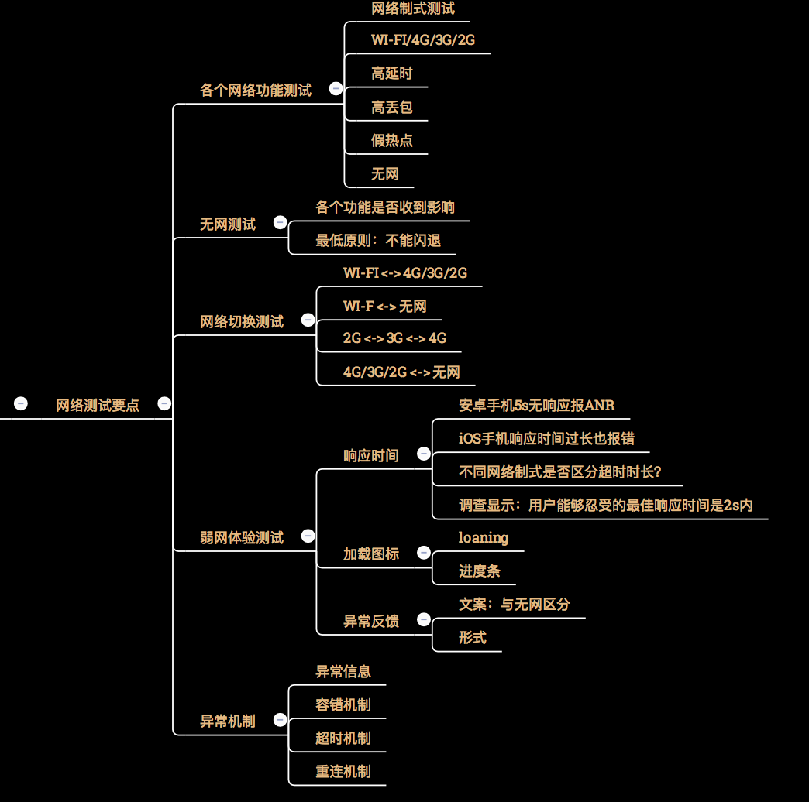
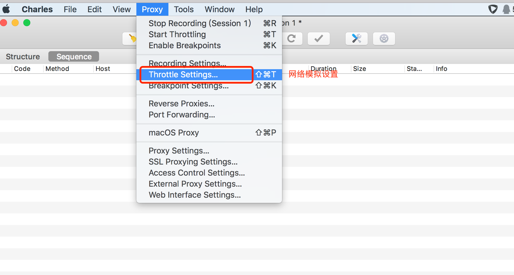
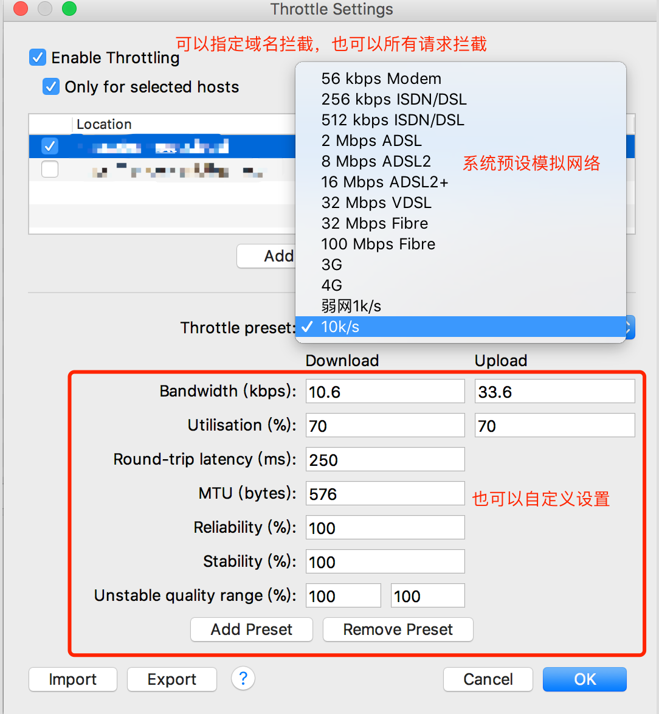
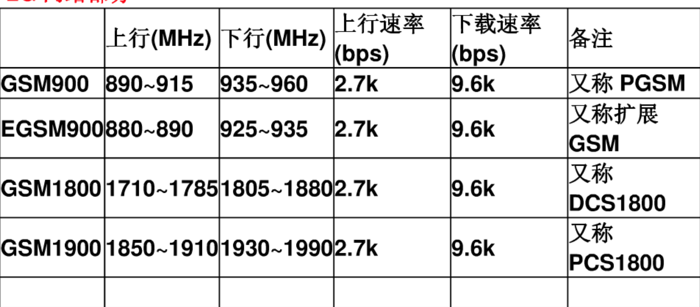
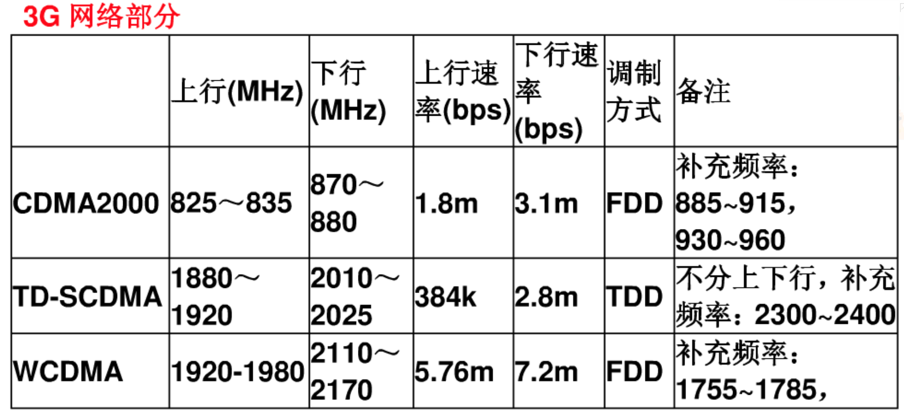
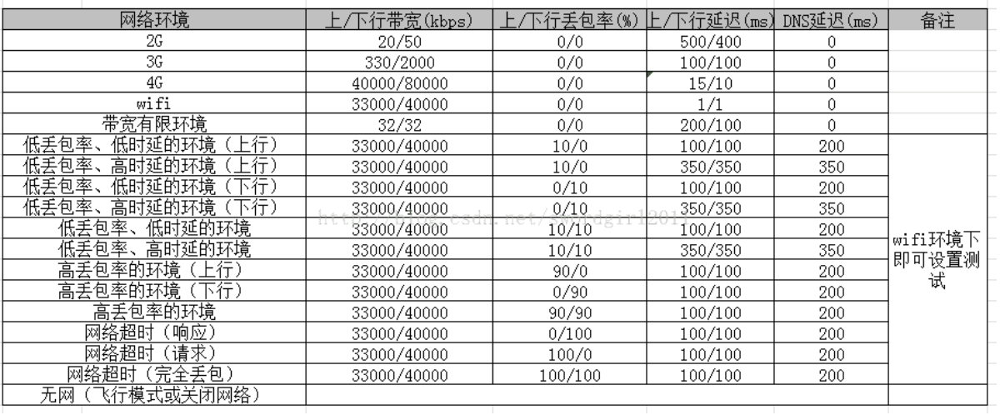

## 1、概要

​		当前APP网络环境比较复杂，网络制式有2G、3G、4G、5G网络，还有越来越多的公共Wi-Fi。不同的网络环境和网络制式的差异，都会对用户使用app造成一定影响。另外，当前app使用场景多变，如进地铁、上公交、进电梯等，使得弱网测试显得尤为重要。如果app没有对各种网络异常进行兼容处理，那么用户可能在日常生活中遇到APP闪退、ANR、数据丢失等问题。因此，app网络测试，特别是弱网测试尤为重要。本文梳理了app网络测试要点和弱网测试常用模拟方法，让大家对网络测试有一个全面的认识。

## 2、网络测试要点

### 2.1、各个网络下功能测试

- 不同网络下，检查基本功能点
- 运营商移动、联通、电信接入点测试（需要使用实际SIM卡）
- 若有智能DNS功能，还需要关注运营商判断/归类
- 高延时、高丢包、无网、假热点也可归入弱网测试范畴

### 2.2、网络切换测试

部分APP有智能DNS功能，网络切换涉及DNS切换。
网络切换检测机制：Android可以监听系统广播

### 2.3、弱网测试

用户体验和异常处理是各个网络场景都需要关注的，只是弱网场景下，需要重点关注。

## 3、弱网测试模拟

### 3.1、什么样的网络属于弱网

低于2G速率的时候都属于弱网，3G也可划分为弱网，一般Wi-Fi不划入弱网测试范畴。

### 3.2、如何进行弱网测试

* SIM卡的网络切换
  手机-设置-移动网络设置-网络类型选择
  3G、4G卡都可以设置关闭3G/4G，只走2G网络。
* 具体弱网场景测试，常见场景包括：地铁/巴士、电梯、楼梯间、停车场
* 使用虚拟机模拟网络速度，如用树莓派搭建的弱网测试仪
* 使用软件进行网络代理，模拟不同的网络带宽、延时率、丢包率

### 3.3、弱网模拟常用工具

#### 3.3.1、charles弱网模拟

**配置参数说明：**
**bandwidth —— 带宽，即上行、下行数据传输速度**
**utilisation —— 带宽可用率，大部分modern是100%**
**round-trip latency —— 第一个请求的时延，单位是ms。**
**MTU —— 最大传输单元，即TCP包的最大size，可以更真实模拟TCP层，每次传输的分包情况。**
**Releability —— 指连接的可靠性。这里指的是10kb的可靠率。用于模拟网络不稳定。**
**Stability —— 连接稳定性，也会影响带宽可用性。用于模拟移动网络，移动网络连接一般不可靠。**

#### 3.3.2、网络参数配置

