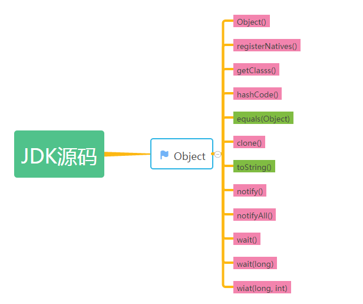

### 1、Object 方法

java.lang.Object为java所有类的基类，所以一般的类都可用重写或直接使用Object下方法，以下为逻辑结构图:



**<u>注： 以上绿色方法为 非native方法  粉色方法为 native方法</u>**

Object类中的方法如下：

```java
Object()：构造方法。 
registerNatives()：装载本地库。 
getClass()：返回此 Object的运行时类。 
hashCode()：返回对象的哈希码值。 
equals(Object)：指示一些其他对象是否等于此。 
clone()：创建并返回此对象的副本。 
toString()：返回对象的字符串表示形式。 
notify()：唤醒正在等待对象监视器的单个线程。 
notifyAll()：唤醒正在等待对象监视器的所有线程。 
wait(long)：使当前线程等待，直到另一个线程调用notify()方法或该对象的notifyAll()方法，或指定时间已过。 
wait(long,int)：使当前线程等待，直到另一个线程调用该对象的notify()方法或notifyAll()方法，或指定时间已过。 
wait()：使当前线程等待，直到另一个线程调用该对象的notify()方法或notifyAll()方法。 
finalize()：当垃圾收集确定不再有对该对象的引用时，在对象上调用该方法。
```

### 2、Object()

​	类构造器是创建Java对象的途径之一。一个类必须要有一个构造器的存在，如果没有显示声明，那么系统会默认创造一个无参构造器。 
​	在JDK的Object类源码中，我们可以发现并没有看到构造器的，系统会自动添加一个无参构造器。 
我们可以通过以下代码构造一个Object类的对象： Object obj = new Object();

### 3、registerNatives()

源码如下： 

```java
private static native void registerNatives();
```

这是一个本地方法。 
我们接着往下看，可以看到这样一段代码：

```java
static {
    registerNatives();
}
```
我们知道一个类定义了本地方法后，想要调用操作系统的实现，必须还要装载本地库。上面的这段代码是一个静态代码块，所以在类加载的时候会执行该方法，通过该方法来注册本地方法。

对应的C代码

```c
static JNINativeMethod methods[] = {
    {"hashCode",    "()I",                    (void *)&JVM_IHashCode},
    {"wait",        "(J)V",                   (void *)&JVM_MonitorWait},
    {"notify",      "()V",                    (void *)&JVM_MonitorNotify},
    {"notifyAll",   "()V",                    (void *)&JVM_MonitorNotifyAll},
    {"clone",       "()Ljava/lang/Object;",   (void *)&JVM_Clone},
};

JNIEXPORT void JNICALL
Java_java_lang_Object_registerNatives(JNIEnv *env, jclass cls)
{
    (*env)->RegisterNatives(env, cls,
                            methods, sizeof(methods)/sizeof(methods[0]));
}
```

### 3、getClass()

接下来来看该方法的源码： 
public final native Class<?> getClass();

该方法被声明为public final native方法，这说明该方法无法被重写，且是一个本地方法。 
通过API文档说明，我们可以知道该方法的作用是返回一个对象的运行时类，通过这个类对象我们可以获取该运行时类的相关属性和方法。

我们知道Java中还可以通过 类名.class 获取这个类的类对象，我们来比较一下这两种用法有什么区别，来加深对这个方法的理解。 
我们写一个父类： 

```java
public class Parent {} 
```

再写一个子类： 

再写一个子类： 

```java
public class Son extends Parent {} 
```

再来一段测试代码

再来一段测试代码

```java
public class Test {

    public static void main(String[] args) {
        Parent p = new Son();
        System.out.println(p.getClass());
        System.out.println(Parent.class);
    }
}
```
我们运行一下，输出如下：

class test.Son
class test.Parent
1
2

### 4、hashCode()

来看源码： 
public native int hashCode();

这也是一个用 native 声明的本地方法，作用是返回对象的散列码，是 int 类型的数值。 
通过刚才查看API文档，我们可以知道hashcode的3个约定： 
1. 在程序运行时期间，只要对象的变化不会影响equals方法的判断结果，那么，在这个期间无论调用多少次hashCode，都必须返回同一个散列码。 
2. 通过equals调用返回true的2个对象的hashCode一定一样。 
3. 通过equasl返回false的2个对象的散列码可以一样也可以不一样。

也就是说： 
两个对象相等，其hashCode一定相同; 
两个对象不相等，其hashCode有可能相同; 
hashCode相同的两个对象，不一定相等; 
hashCode不相同的两个对象，一定不相等;

那么这个方法有什么用呢？ 
我们知道在Java 中有几种集合类，其中Set存放的元素是不可重复的。 
在Set中，每增加一个元素，我们就通过equals方法判断集合中的每一个元素是否重复。如果集合中有10000个元素，我们新加入一个元素时，那就需要进行10000次equals方法的调用，这显然效率很低。 
于是，Java就采用了哈希表来实现。哈希算法也称为散列算法，是将数据依特定算法产生的结果直接指定到一个地址上。这个结果就是由hashCode方法产生。当集合要添加新的元素时，先调用这个元素的hashCode方法，就一下子能定位到它应该放置的物理位置上。如果这个位置上没有元素，它就可以直接存储在这个位置上；如果这个位置上已经有元素了，就调用它的equals方法与新元素进行比较，相同的话就不存了；不相同的话，也就是发生了Hash key相同导致冲突的情况，那么就在这个Hash key的地方产生一个链表，将所有产生相同HashCode的对象放到这个单链表上去，串在一起。这样一来实际调用equals方法的次数就大大降低了。

那也许我们会想，对于不能重复的集合比如Set，为什么不让hashCode对于每个元素都产生唯一的值，相等的元素就产生一样的hashcode，不一样的元素就产生不一样的hashcode，这样不就完全不需要调用equals方法来判断是否相同了吗？ 
实际上对于元素不是很多的情况下，直接通过hashCode产生唯一的索引值，通过这个索引值能直接找到元素，而且还能判断是否相同，这很好。就像数据库存储的数据的主键或者是rowid一样，我们能通过主键或者rowid直接找到某个元素。但实际上，很难实现hashCode的唯一算法，就算能实现，产生的hashCode码也是非常大的，这会大的超过int所能表示的范围，很占内存空间。

所以，我们在编写hashcode方法时要注意以下几点： 
- 不同对象的hash码应该尽量不同，避免hash冲突，也就是算法获得的元素要尽量均匀分布。 
- hash 值是int 类型，在Java中占用4个字节，也就是2的32次方，不要溢出。 
- 对于Map集合，我们可以选取Java中的基本类型，以及String作为 key，因为它们都按照规范重写了equals方法和hashCode方法。但是如果你用自定义对象作为key，那么一定要重写 equals方法和hashCode方法。

像Integer类，String类等都重写了hashCode方法，我们自定义对象的hashCode方法可以参考这些类来写。

### 5、equals(Object)

方法源码如下：

```java
public boolean equals(Object obj) {
    return (this == obj);
}
```

看了源码我们知道，在Object类中，==运算符和equals方法是等价的，都是比较两个对象的引用是否相等。对于我们自定义的一个对象，如果不重写equals方法，那么在比较对象的时候就是调用Object类的equals方法，也就是用==运算符比较两个对象。

这里我们看一下String类中重写equals方法的源码：

```java
public boolean equals(Object anObject) {
    if (this == anObject) {
        return true;
    }
    if (anObject instanceof String) {
        String anotherString = (String)anObject;
        int n = value.length;
        if (n == anotherString.value.length) {
            char v1[] = value;
            char v2[] = anotherString.value;
            int i = 0;
            while (n-- != 0) {
                if (v1[i] != v2[i])
                    return false;
                i++;
            }
            return true;
        }
    }
    return false;
}
```

可以看到，String类定义两个对象相等的标准是字符串内容都相同，而不是引用是否相等。

假如我们有一个自定义的Parent类，里面有两个属性，我们自定义两个对象相等的标尺为Parent对象的两个属性都相等，则对象相等，否则不相等。 
那么我们来仿照上面String对equals的重写，我们来重写一下Parent的equals方法：

```java
public class Parent {
    private String name;

    private String age;

    public Parent() {
    }

    public Parent(String name, String age) {
        this.name = name;
        this.age = age;
    }

    public String getName() {
        return name;
    }

    public void setName(String name) {
        this.name = name;
    }

    public String getAge() {
        return age;
    }

    public void setAge(String age) {
        this.age = age;
    }

    @Override
    public boolean equals(Object obj) {
        // 引用相等那么两个对象当然相等
        if (this == obj) {
            return true;
        }
        // 对象为空则不相等
        if (obj == null) {
            return false;
        }
        // 对象不是Parent类的实例则不相等
        if (!(obj instanceof Parent)) {
            return false;
        }
        Parent otherParent = (Parent) obj;
        if (otherParent.getName().equals(this.getName()) 
            && otherParent.getAge() == this.getAge()) {
            return true;
        }
        return false;
    }
}
```


然后写一个测试方法：

```java
public class Test {
    public static void main(String[] args) {
        Parent p1 = new Parent("Alice", "20");
        Parent p2 = new Parent("Tom", "21");
        Parent p3 = new Parent("Alice", "20");
        System.out.println(p1.equals(p2));
        System.out.println(p1.equals(p3));
    }
}
```


看到上面的测试main方法输出，第一个是false，第二个是true，我们觉得这个equals实现的好像没什么问题。 
如果我们有个Son类继承了Parent类，Son类也同样重写了equals方法，Son类如下：

```java
public class Son extends Parent {
    private String idNo;

    private String score;

    public Son() {
    }

    public Son(String name, String age, String idNo, String score) {
        super(name, age);
        this.idNo = idNo;
        this.score = score;
    }

    public String getIdNo() {
        return idNo;
    }

    public void setIdNo(String idNo) {
        this.idNo = idNo;
    }

    public String getScore() {
        return score;
    }

    public void setScore(String score) {
        this.score = score;
    }

    @Override
    public boolean equals(Object obj) {
        // 引用相等那么两个对象当然相等
        if (this == obj) {
            return true;
        }
        // 对象为空则不相等
        if (obj == null) {
            return false;
        }
        // 对象不是Son类的实例则不相等
        if (!(obj instanceof Son)) {
            return false;
        }
        Son otherSon = (Son) obj;
        if (otherSon.getIdNo().equals(this.getIdNo()) 
            && otherSon.getScore() == this.getScore()) {
            return true;
        }
        return false;
    }
}
```

这时候我们再来写一个测试方法：

```java
public class Test {
    public static void main(String[] args) {
        Parent p = new Parent("Alice", "20");
        Son s = new Son("Alice", "20", "001", "95");
        System.out.println(p.equals(s));
        System.out.println(s.equals(p));
    }
}
```


我们看到第一个输出为true，第二个输出竟然是false！这明显违反了我们上面说的equals的几个约定中的对称性。 
细看一下我们发现，问题出现在 instanceof 关键字上，Son是Parent的子类，所以Son instanceof Parent当然是true，但是Parent instanceof Son就自然是false了。 
所以，instanceof是做不到对称性的要求的，我们可以使用getClass()方法来代替instanceof运算符，把上面Parent类中使用instanceof的地方改为以下代码：

```java
if (getClass() != obj.getClass()) {
    return false;
}
```


再次运行测试方法，可以看到输出都是false，满足对称性。

再次运行测试方法，可以看到输出都是false，满足对称性。

但是我们也要注意，也不是什么时候都要使用getClass，毕竟自定义对象是否相等的标准是由自己定义的。而且使用getClass不符合多态的设计思想。比如一个父类有两个子类,子类中没有自定义相等的概念，也就是说没有重写equals，如果使用getClass实现父类equals方法的重写，那么就不能在两个不同子类的对象进行相等的比较。 
所以，如果子类能够拥有自己的相等概念，则根据对称性需求，我们需要采用getClass()；如果由父类决定相等的概念，那么就可以使用instanceof，这样可以在不同的子类的对象之间进行相等的比较。

下面给出重写equals方法的最佳实践： 
1. 参数命名为otherObject，稍后会将它转换成另一个叫做other的变量。 
2. 用==判断比较的两个对象引用是否相等，如果引用相等那么表示是同一个对象，那么当然相等。 
3. 如果otherObject为null，直接返回false。 
4. 比较this和otherObject是否是同一个类：如果equals的语义在每个子类中有所改变，就使用getClass()判断；如果所有的子类都有统一的定义，那么使用instanceof判断。 
5. 将otherObject转换成对应类的变量。 
6. 最后对对象的属性进行比较。使用==比较基本类型，使用equals比较对象。如果都相等则返回true，否则返回false。注意如果是在子类中定义equals，则要包含 super.equals(other)。

那么根据刚才的最佳实践，我们来重新写一下上面的Parent类的equals方法：

```java
@Override
public boolean equals(Object otherObject) {
    // 用==判断比较的两个对象引用是否相等，如果引用相等那么表示是同一个对象，那么当然相等。
    if (this == otherObject) {
        return true;
    }
    // 如果otherObject为null，直接返回false。
    if (otherObject == null) {
        return false;
    }
    // 比较this和otherObject是否是同一个类
    // 以下两种写法二选一
    // 如果equals的语义在每个子类中有所改变，就使用getClass()判断
    if (getClass() != otherObject.getClass()) {
        return false;
    }

    // 如果所有的子类都有统一的定义，那么使用instanceof判断
    if (!(otherObject instanceof Parent)) {
        return false;
    }

    // 将otherObject转换成对应类的变量。
    Parent otherParent = (Parent) otherObject;

    // 最后对对象的属性进行比较。使用==比较基本类型，使用equals比较对象。如果都相等则返回true，否则返回false。
    if (otherParent.getName().equals(this.getName()) 
        && otherParent.getAge() == this.getAge()) {
        return true;
    }
    return false;
}
```

最后再提醒一下不要忘记，API中的最后有一句话，一般来说重写equals方法，就要重写hashCode方法，以便保持hashCode方法的通用约定，即相等的对象必须具有相等的hashcode。

### 6、clone()

该方法源码如下： 
protected native Object clone() throws CloneNotSupportedException;

其实文档讲的还是蛮清楚的，我们再次强调一下，clone()的正确调用是需要实现Cloneable接口，如果没有实现Cloneable接口，子类直接调用Object类的clone()方法，则会抛出CloneNotSupportedException异常。 
来看一下Cloneable的源码：

```java
public interface Cloneable {
}
```


可以发现，Cloneable接口仅是一个表示接口，它本身不包含任何方法，用来指示Object.clone()可以合法的被子类所调用。

使用clone方法的优点是速度快，而且灵活。速度快是因为clone方法最终会调用Object.clone()方法，这是一个native方法，本质是内存块复制，所以在速度上比使用new创建对象要快。灵活是因为可以在运行时动态的获取对象的类型以及状态，从而创建一个对象。

但是clone创建对象的缺点也很明显：实现深拷贝较为困难，需要整个类继承的所有类以及所有的属性都很好的实现clone方法。另外就是需要处理CloneNotSupportedException异常。

因此，我们如果想使用clone方法的话，需要非常谨慎。事实上，更建议的不是实现Cloneable接口，而是编写拷贝构造器。

### 7、toString()

该方法源码如下：

```java
public String toString() {
    return getClass().getName() + "@" + Integer.toHexString(hashCode());
}
```

打印某个对象时，默认是调用toString方法。不过从源码我们可以看到，默认的toString返回的内容可读性并不好，所以通常都要重写toString，输出需要的实例信息，比如某些属性的值。

### 8、notify()

该方法源码如下： 
public final native void notify(); 
这个方法是用于多线程操作的，我们先来看一下同样也是用于多线程的另外几个方法。

### 9、notifyAll()

通过查看API，我们知道这个notifyAll()和刚才的notify()差不多，只是notify()是随机唤醒一个等待的线程，而notifyAll()是唤醒正在等待对象监视器的所有线程。

该方法源码如下： 

```java
public final native void notifyAll();
```

### 10、wait(long)

方法源码如下： 

```java
public final native void wait(long timeout) throws InterruptedException;
```

### 11、wait(long, int)

再来看一下源码：

```java
public final void wait(long timeout, int nanos) throws InterruptedException {
    if (timeout < 0) {
        throw new IllegalArgumentException("timeout value is negative");
    }

    if (nanos < 0 || nanos > 999999) {
        throw new IllegalArgumentException(
                            "nanosecond timeout value out of range");
    }

    if (nanos > 0) {
        timeout++;
    }

    wait(timeout);
}
```


### 12、wait()

源码如下：

```java
public final void wait() throws InterruptedException {
    wait(0);
}
```

以上这几个方法，notify，notifyAll，wait，都是public final native的，不可以被子类重写，且都是本地方法。这几个方法提供了java线程间等待、挂起等协同机制，是java多线程的基础。这里我们就先大致看一下源码，等后面研究到多线程的时候再来仔细解读它们。

### 13、finalize()

源码如下： 

```java
protected void finalize() throws Throwable { }
```

​	该方法用于垃圾回收，一般由 JVM 自动调用，一般不需要程序员去手动调用该方法。这里我们就只是先看一下API怎么讲，后面细究 JVM 的时候再详细描述。

---------------------


