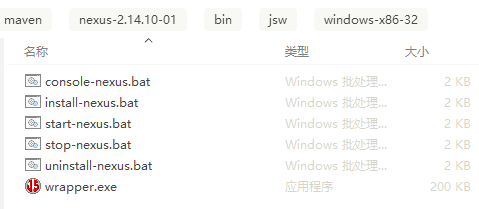
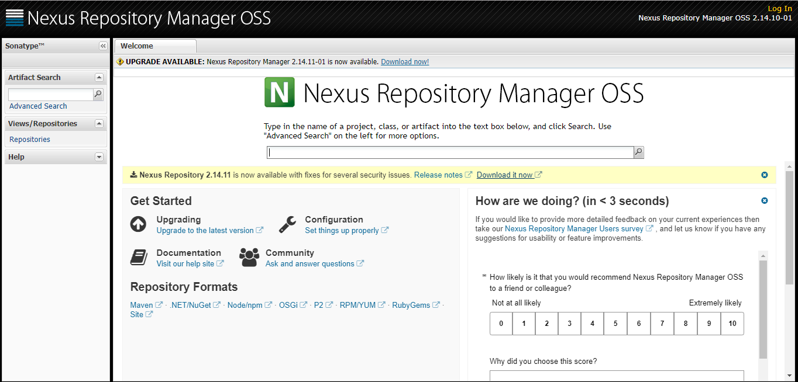
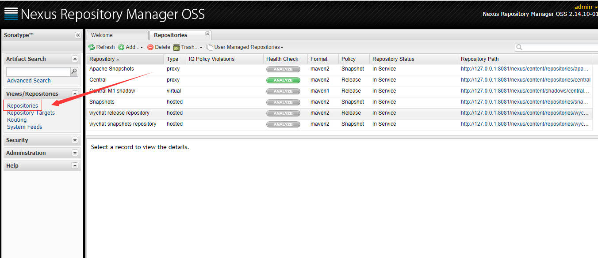
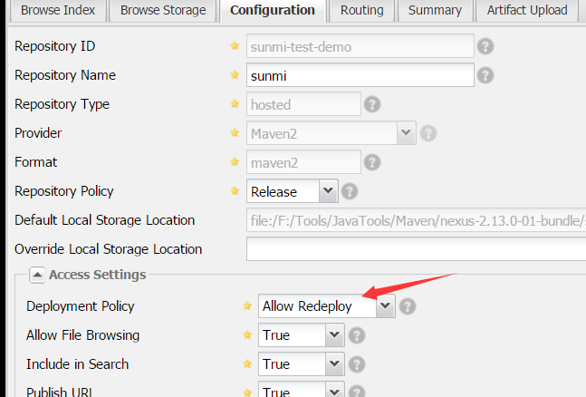

### 一、什么是Maven,Gradle?

​	Maven 是一个项目管理和自动构建工具。Maven 包集中存放的地方，就是 Maven 仓库。这些仓库，可以是放在本地，也可以放在某个远程服务器上。 可以是私有仓库，也可以是公开的。下开发用的库列表：

```groovy
mavenCentral();
jcenter()
maven {
     url 'file:///Users/my-user-name/Documents/Android/repo/'
}
maven {
     url 'http://localhost:8081/nexus/content/repositories/releases/'
}
```

Android Studio Gradle 主要支持两个 Maven 中央库：mavenCentral 和 jcenter。

mavenCentral 是最早的 maven 中央仓库
jcenter 是 Android Studio 0.8 版本起的默认 maven 中央仓库
第三个是我的本机的仓库
第四个是笔者部署在内网服务器的私有仓库

​	Gradle 是一个基于Apache Ant和Apache Maven概念的项目自动化建构工具。它使用一种基于Groovy的特定领域语言来声明项目设置，而不是传统的XML

### 二、使用Nexus搭建maven私服

1.Nexus 下载安装：

​	官网下载地址：http://www.sonatype.org/nexus/go/，我的开发环境是Windows，我下载的是Nexus Repository Manager OSS 2.xx下面的 All platforms nexus-2.14.10-01-bundle.zip压缩文件。

2.Nexus 启动：

​	下载完成之后，解压后进入\nexus-2.14.10-01-bundle\bin\jsw\，根据操作系统类型选择文件夹，我选的是windows-x86-32文件夹，进入后可看到如下所示bat文件。 



​	双击console-nexus.bat运行。再浏览器中输入[http://127.0.0.1:8081/nexus/，](http://127.0.0.1:8081/nexus/)出现下图所示就代表nexus已经启动成功了。



​	8081是默认的端口号，要修改端口号，进入\conf\打开nexus.properties文件，修改application-port属性值就可以了。 
默认的用户名和密码分别是：admin和admin123。点击右上角的log in 登录后如图所示： 
点击左侧的 repositories 查看现有的仓库列表： 



3.Nexus仓库：
这里的仓库分了四种类型

hosted(宿主仓库):用来部署自己,第三方或者公共仓库的构件

proxy(代理仓库):代理远程仓库

virtual(虚拟仓库):默认提供了一个 Central M1虚拟仓库 用来将maven 2适配为maven 1

group(仓库组):统一管理多个仓库


Public Repositories: 仓库组

3rd party: 无法从公共仓库获得的第三方发布版本的构件仓库

Apache Snapshots: 用了代理ApacheMaven仓库快照版本的构件仓库

Central: 用来代理maven中央仓库中发布版本构件的仓库

Central M1 shadow: 用于提供中央仓库中M1格式的发布版本的构件镜像仓库

Codehaus Snapshots: 用来代理CodehausMaven 仓库的快照版本构件的仓库

Releases: 用来部署管理内部的发布版本构件的宿主类型仓库

Snapshots:用来部署管理内部的快照版本构件的宿主类型仓库

4.建立Nexus宿主仓库

​	新建一个内部仓库，步骤为Repositories –> Add –> Hosted Repository，在页面的下半部分输入框中填入Repository ID和Repository Name即可，另外把Deployment Policy设置为Allow Redeploy，点击save就创建完成了。这里我点击添加宿主类型的仓库，在仓库列表的下方会出现新增仓库的配置，如下所示： 



​	建立好新的仓库之后需要配置一下相关账号信息.在安全选项下选择用户选项,可以看到三个默认的账号,分别是管理员账号,部署账号和Nexus账号.正常访问仓库内容的时候是不需要这三个账户的,一般也就是把部署账号暴露出去,方便仓库项目维护人员部署项目使用.所以这里可以用默认的Deployment账户(记得重置下密码).也可以新建一个账号来使用,新建的时候可以通过add role management来控制该账号的权限。 
​	点击新建的仓库的url可以直接如今仓库的路劲，因为现在还没有部署项目，所以是空的仓库。